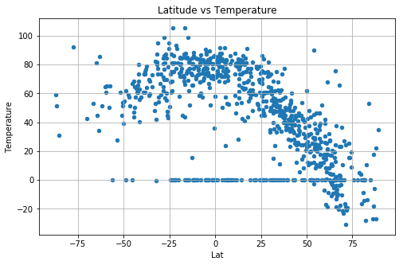
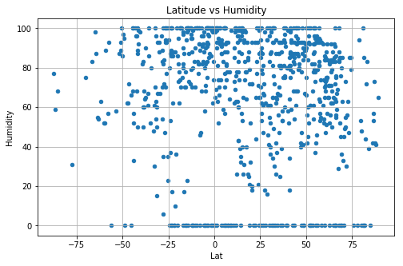
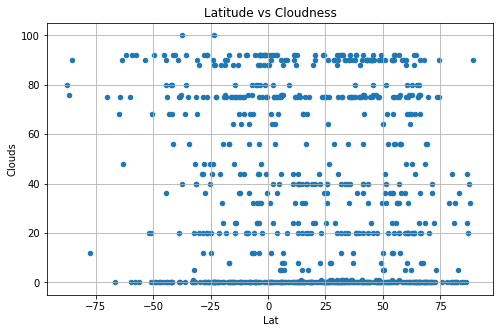
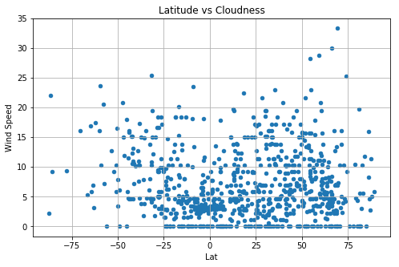

# WeatherPy


# Analysis

##### Note*: Coordinates are randomly generted from a 2,000 random number pool so the result will be different everytime after re-running the codes
 
## Observed Trend 1:
Based on the data given, the closer to the equator, the higher the temperature

## Observed Trend 2:
Based on the data given, there was no corelation between Humidity and Latitude

## Observed Trend 3:
The windspeed for most cities fall under 20mph and there seems to be no corelation between wind speed and Latitude


```python
# Import dedendencies
import pandas as pd
import requests as req
from citipy import citipy 
import matplotlib.pyplot as plt
import random
import seaborn as sns
import time as time
from config import api_key
```


```python
# Create list of random latitudes and longitudes
df= pd.DataFrame(columns =['Lat',"Lng","City","Temperature","Humidity","Clouds","Wind Speed"])

# Create list to hold values
lat = []
lng = []

# Loop through 0-2000 for city count 
for x in range(0,2000):
    
    # Adding random number for lat list in (-90 to 90) and for lng list in (-180 to 180)
    lat.append(random.uniform(-90,90))
    lng.append(random.uniform(-180,180))

# Adding lat and lng value to dataframe
df['Lat'] = lat
df['Lng'] = lng

df.head()
```


<div>
<style>
    .dataframe thead tr:only-child th {
        text-align: right;
    }

    .dataframe thead th {
        text-align: left;
    }

    .dataframe tbody tr th {
        vertical-align: top;
    }
</style>
<table border="1" class="dataframe">
  <thead>
    <tr style="text-align: right;">
      <th></th>
      <th>Lat</th>
      <th>Lng</th>
      <th>City</th>
      <th>Temperature</th>
      <th>Humidity</th>
      <th>Clouds</th>
      <th>Wind Speed</th>
    </tr>
  </thead>
  <tbody>
    <tr>
      <th>0</th>
      <td>-64.370348</td>
      <td>-96.302847</td>
      <td>NaN</td>
      <td>NaN</td>
      <td>NaN</td>
      <td>NaN</td>
      <td>NaN</td>
    </tr>
    <tr>
      <th>1</th>
      <td>77.929011</td>
      <td>46.404740</td>
      <td>NaN</td>
      <td>NaN</td>
      <td>NaN</td>
      <td>NaN</td>
      <td>NaN</td>
    </tr>
    <tr>
      <th>2</th>
      <td>1.381099</td>
      <td>28.391806</td>
      <td>NaN</td>
      <td>NaN</td>
      <td>NaN</td>
      <td>NaN</td>
      <td>NaN</td>
    </tr>
    <tr>
      <th>3</th>
      <td>25.579901</td>
      <td>-38.730524</td>
      <td>NaN</td>
      <td>NaN</td>
      <td>NaN</td>
      <td>NaN</td>
      <td>NaN</td>
    </tr>
    <tr>
      <th>4</th>
      <td>-64.724747</td>
      <td>-141.375550</td>
      <td>NaN</td>
      <td>NaN</td>
      <td>NaN</td>
      <td>NaN</td>
      <td>NaN</td>
    </tr>
  </tbody>
</table>
</div>


# Generate City List


```python
# Create list to hold values
cities = []

# Iterate over DataFrame rows as (index, Series) pairs
for index, row in df.iterrows():
    city = citipy.nearest_city(row["Lat"],row["Lng"])

    # Adding values to cities list
    cities.append(city.city_name)

# Adding city value to dataframe
df['City'] = cities

df.head()
```


<div>
<style>
    .dataframe thead tr:only-child th {
        text-align: right;
    }

    .dataframe thead th {
        text-align: left;
    }

    .dataframe tbody tr th {
        vertical-align: top;
    }
</style>
<table border="1" class="dataframe">
  <thead>
    <tr style="text-align: right;">
      <th></th>
      <th>Lat</th>
      <th>Lng</th>
      <th>City</th>
      <th>Temperature</th>
      <th>Humidity</th>
      <th>Clouds</th>
      <th>Wind Speed</th>
    </tr>
  </thead>
  <tbody>
    <tr>
      <th>0</th>
      <td>-64.370348</td>
      <td>-96.302847</td>
      <td>punta arenas</td>
      <td>NaN</td>
      <td>NaN</td>
      <td>NaN</td>
      <td>NaN</td>
    </tr>
    <tr>
      <th>1</th>
      <td>77.929011</td>
      <td>46.404740</td>
      <td>belushya guba</td>
      <td>NaN</td>
      <td>NaN</td>
      <td>NaN</td>
      <td>NaN</td>
    </tr>
    <tr>
      <th>2</th>
      <td>1.381099</td>
      <td>28.391806</td>
      <td>wamba</td>
      <td>NaN</td>
      <td>NaN</td>
      <td>NaN</td>
      <td>NaN</td>
    </tr>
    <tr>
      <th>3</th>
      <td>25.579901</td>
      <td>-38.730524</td>
      <td>ponta do sol</td>
      <td>NaN</td>
      <td>NaN</td>
      <td>NaN</td>
      <td>NaN</td>
    </tr>
    <tr>
      <th>4</th>
      <td>-64.724747</td>
      <td>-141.375550</td>
      <td>rikitea</td>
      <td>NaN</td>
      <td>NaN</td>
      <td>NaN</td>
      <td>NaN</td>
    </tr>
  </tbody>
</table>
</div>


```python
# Remove duplicates and make sure there are atleast 500 unique cities to test
df = df.drop_duplicates("City",keep="first")
len(df)
```


    762


```python
# Test to see if API was retrieved
# Setting base URL, city value and unit
url = "http://api.openweathermap.org/data/2.5/weather?"
city = "margate"
units = "imperial"

# Build query URL and request your results in Celsius
query_url = f"{url}appid={api_key}&q={city}&units={units}"

# Get weather data
weather_response = req.get(query_url)
weather_json = weather_response.json()
weather_json
```


    {'base': 'stations',
     'clouds': {'all': 75},
     'cod': 200,
     'coord': {'lat': -43.03, 'lon': 147.26},
     'dt': 1521178200,
     'id': 2158744,
     'main': {'humidity': 52,
      'pressure': 1015,
      'temp': 64.4,
      'temp_max': 64.4,
      'temp_min': 64.4},
     'name': 'Margate',
     'sys': {'country': 'AU',
      'id': 8195,
      'message': 0.0037,
      'sunrise': 1521144502,
      'sunset': 1521189006,
      'type': 1},
     'visibility': 10000,
     'weather': [{'description': 'broken clouds',
       'icon': '04d',
       'id': 803,
       'main': 'Clouds'}],
     'wind': {'deg': 40, 'speed': 16.11}}


# Perform API Calls


```python
count = 0

# Create list to hold values
temp=[]
humidity =[]
clouds = []
wind_speed = []


for index,row in df.iterrows():
    count+= 1
    query_url = url + "appid=" + api_key + "&units=" + units + "&q=" + row['City']
    print("City number "+str(count))
    print(f"City Name: "+row["City"])
    print(query_url)   
    
    try:
        info = req.get(query_url).json()
        temp.append(info['main']['temp'])
        humidity.append(info['main']['humidity'])
        clouds.append(info['clouds']['all'])
        wind_speed.append(info['wind']['speed'])
    
    except:
        temp.append(0)
        humidity.append(0)
        clouds.append(0)
        wind_speed.append(0)


print("-"*100)
print("                Data Retrieval Complete")
print("-"*100)
```

    City number 1
    City Name: punta arenas
    http://api.openweathermap.org/data/2.5/weather?appid=2ee982bfdaaba69c0474d9d26fdf68ac&units=imperial&q=punta arenas
    City number 2
    City Name: belushya guba
    http://api.openweathermap.org/data/2.5/weather?appid=2ee982bfdaaba69c0474d9d26fdf68ac&units=imperial&q=belushya guba
    City number 3
    City Name: wamba
    http://api.openweathermap.org/data/2.5/weather?appid=2ee982bfdaaba69c0474d9d26fdf68ac&units=imperial&q=wamba
    City number 4
    City Name: ponta do sol
    http://api.openweathermap.org/data/2.5/weather?appid=2ee982bfdaaba69c0474d9d26fdf68ac&units=imperial&q=ponta do sol
    City number 5
    City Name: rikitea
    http://api.openweathermap.org/data/2.5/weather?appid=2ee982bfdaaba69c0474d9d26fdf68ac&units=imperial&q=rikitea
    City number 6
    City Name: kahului
    http://api.openweathermap.org/data/2.5/weather?appid=2ee982bfdaaba69c0474d9d26fdf68ac&units=imperial&q=kahului
    City number 7
    City Name: berlevag
    http://api.openweathermap.org/data/2.5/weather?appid=2ee982bfdaaba69c0474d9d26fdf68ac&units=imperial&q=berlevag
    City number 8
    City Name: bengkulu
    http://api.openweathermap.org/data/2.5/weather?appid=2ee982bfdaaba69c0474d9d26fdf68ac&units=imperial&q=bengkulu
    City number 9
    City Name: college
    http://api.openweathermap.org/data/2.5/weather?appid=2ee982bfdaaba69c0474d9d26fdf68ac&units=imperial&q=college
    City number 10
    City Name: taolanaro
    http://api.openweathermap.org/data/2.5/weather?appid=2ee982bfdaaba69c0474d9d26fdf68ac&units=imperial&q=taolanaro
    City number 11
    City Name: veraval
    http://api.openweathermap.org/data/2.5/weather?appid=2ee982bfdaaba69c0474d9d26fdf68ac&units=imperial&q=veraval
    City number 12
    City Name: mataura
    http://api.openweathermap.org/data/2.5/weather?appid=2ee982bfdaaba69c0474d9d26fdf68ac&units=imperial&q=mataura
    City number 13
    City Name: lagoa
    http://api.openweathermap.org/data/2.5/weather?appid=2ee982bfdaaba69c0474d9d26fdf68ac&units=imperial&q=lagoa
    City number 14
    City Name: talaya
    http://api.openweathermap.org/data/2.5/weather?appid=2ee982bfdaaba69c0474d9d26fdf68ac&units=imperial&q=talaya
    City number 15
    City Name: esperance
    http://api.openweathermap.org/data/2.5/weather?appid=2ee982bfdaaba69c0474d9d26fdf68ac&units=imperial&q=esperance
    City number 16
    City Name: port macquarie
    http://api.openweathermap.org/data/2.5/weather?appid=2ee982bfdaaba69c0474d9d26fdf68ac&units=imperial&q=port macquarie
    City number 17
    City Name: vaini
    http://api.openweathermap.org/data/2.5/weather?appid=2ee982bfdaaba69c0474d9d26fdf68ac&units=imperial&q=vaini
    City number 18
    City Name: krasnoselkup
    http://api.openweathermap.org/data/2.5/weather?appid=2ee982bfdaaba69c0474d9d26fdf68ac&units=imperial&q=krasnoselkup
    City number 19
    City Name: gao
    http://api.openweathermap.org/data/2.5/weather?appid=2ee982bfdaaba69c0474d9d26fdf68ac&units=imperial&q=gao
    City number 20
    City Name: katsuura
    http://api.openweathermap.org/data/2.5/weather?appid=2ee982bfdaaba69c0474d9d26fdf68ac&units=imperial&q=katsuura
    City number 21
    City Name: sumenep
    http://api.openweathermap.org/data/2.5/weather?appid=2ee982bfdaaba69c0474d9d26fdf68ac&units=imperial&q=sumenep
    City number 22
    City Name: hobart
    http://api.openweathermap.org/data/2.5/weather?appid=2ee982bfdaaba69c0474d9d26fdf68ac&units=imperial&q=hobart
    City number 23
    City Name: nanortalik
    http://api.openweathermap.org/data/2.5/weather?appid=2ee982bfdaaba69c0474d9d26fdf68ac&units=imperial&q=nanortalik
    City number 24
    City Name: acapulco
    http://api.openweathermap.org/data/2.5/weather?appid=2ee982bfdaaba69c0474d9d26fdf68ac&units=imperial&q=acapulco
    City number 25
    City Name: tual
    http://api.openweathermap.org/data/2.5/weather?appid=2ee982bfdaaba69c0474d9d26fdf68ac&units=imperial&q=tual
    City number 26
    City Name: klaksvik
    http://api.openweathermap.org/data/2.5/weather?appid=2ee982bfdaaba69c0474d9d26fdf68ac&units=imperial&q=klaksvik
    City number 27
    City Name: bredasdorp
    http://api.openweathermap.org/data/2.5/weather?appid=2ee982bfdaaba69c0474d9d26fdf68ac&units=imperial&q=bredasdorp
    City number 28
    City Name: merauke
    http://api.openweathermap.org/data/2.5/weather?appid=2ee982bfdaaba69c0474d9d26fdf68ac&units=imperial&q=merauke
    City number 29
    City Name: east london
    http://api.openweathermap.org/data/2.5/weather?appid=2ee982bfdaaba69c0474d9d26fdf68ac&units=imperial&q=east london
    City number 30
    City Name: los llanos de aridane
    http://api.openweathermap.org/data/2.5/weather?appid=2ee982bfdaaba69c0474d9d26fdf68ac&units=imperial&q=los llanos de aridane
    City number 31
    City Name: olafsvik
    http://api.openweathermap.org/data/2.5/weather?appid=2ee982bfdaaba69c0474d9d26fdf68ac&units=imperial&q=olafsvik
    City number 32
    City Name: illoqqortoormiut
    http://api.openweathermap.org/data/2.5/weather?appid=2ee982bfdaaba69c0474d9d26fdf68ac&units=imperial&q=illoqqortoormiut
    City number 33
    City Name: zhoucheng
    http://api.openweathermap.org/data/2.5/weather?appid=2ee982bfdaaba69c0474d9d26fdf68ac&units=imperial&q=zhoucheng
    City number 34
    City Name: hermanus
    http://api.openweathermap.org/data/2.5/weather?appid=2ee982bfdaaba69c0474d9d26fdf68ac&units=imperial&q=hermanus
    City number 35
    City Name: albany
    http://api.openweathermap.org/data/2.5/weather?appid=2ee982bfdaaba69c0474d9d26fdf68ac&units=imperial&q=albany
    City number 36
    City Name: georgetown
    http://api.openweathermap.org/data/2.5/weather?appid=2ee982bfdaaba69c0474d9d26fdf68ac&units=imperial&q=georgetown
    City number 37
    City Name: sucua
    http://api.openweathermap.org/data/2.5/weather?appid=2ee982bfdaaba69c0474d9d26fdf68ac&units=imperial&q=sucua
    City number 38
    City Name: jamestown
    http://api.openweathermap.org/data/2.5/weather?appid=2ee982bfdaaba69c0474d9d26fdf68ac&units=imperial&q=jamestown
    City number 39
    City Name: vila franca do campo
    http://api.openweathermap.org/data/2.5/weather?appid=2ee982bfdaaba69c0474d9d26fdf68ac&units=imperial&q=vila franca do campo
    City number 40
    City Name: hilo
    http://api.openweathermap.org/data/2.5/weather?appid=2ee982bfdaaba69c0474d9d26fdf68ac&units=imperial&q=hilo
    City number 41
    City Name: muravlenko
    http://api.openweathermap.org/data/2.5/weather?appid=2ee982bfdaaba69c0474d9d26fdf68ac&units=imperial&q=muravlenko
    City number 42
    City Name: torbay
    http://api.openweathermap.org/data/2.5/weather?appid=2ee982bfdaaba69c0474d9d26fdf68ac&units=imperial&q=torbay
    City number 43
    City Name: yellowknife
    http://api.openweathermap.org/data/2.5/weather?appid=2ee982bfdaaba69c0474d9d26fdf68ac&units=imperial&q=yellowknife
    City number 44
    City Name: khonuu
    http://api.openweathermap.org/data/2.5/weather?appid=2ee982bfdaaba69c0474d9d26fdf68ac&units=imperial&q=khonuu
    City number 45
    City Name: sosnovo-ozerskoye
    http://api.openweathermap.org/data/2.5/weather?appid=2ee982bfdaaba69c0474d9d26fdf68ac&units=imperial&q=sosnovo-ozerskoye
    City number 46
    City Name: kungurtug
    http://api.openweathermap.org/data/2.5/weather?appid=2ee982bfdaaba69c0474d9d26fdf68ac&units=imperial&q=kungurtug
    City number 47
    City Name: ushuaia
    http://api.openweathermap.org/data/2.5/weather?appid=2ee982bfdaaba69c0474d9d26fdf68ac&units=imperial&q=ushuaia
    City number 48
    City Name: kupang
    http://api.openweathermap.org/data/2.5/weather?appid=2ee982bfdaaba69c0474d9d26fdf68ac&units=imperial&q=kupang
    City number 49
    City Name: novyy urengoy
    http://api.openweathermap.org/data/2.5/weather?appid=2ee982bfdaaba69c0474d9d26fdf68ac&units=imperial&q=novyy urengoy
    City number 50
    City Name: port alfred
    http://api.openweathermap.org/data/2.5/weather?appid=2ee982bfdaaba69c0474d9d26fdf68ac&units=imperial&q=port alfred
    City number 51
    City Name: beloha
    http://api.openweathermap.org/data/2.5/weather?appid=2ee982bfdaaba69c0474d9d26fdf68ac&units=imperial&q=beloha
    City number 52
    City Name: gizo
    http://api.openweathermap.org/data/2.5/weather?appid=2ee982bfdaaba69c0474d9d26fdf68ac&units=imperial&q=gizo
    City number 53
    City Name: dikson
    http://api.openweathermap.org/data/2.5/weather?appid=2ee982bfdaaba69c0474d9d26fdf68ac&units=imperial&q=dikson
    City number 54
    City Name: oktyabrskiy
    http://api.openweathermap.org/data/2.5/weather?appid=2ee982bfdaaba69c0474d9d26fdf68ac&units=imperial&q=oktyabrskiy
    City number 55
    City Name: viligili
    http://api.openweathermap.org/data/2.5/weather?appid=2ee982bfdaaba69c0474d9d26fdf68ac&units=imperial&q=viligili
    City number 56
    City Name: severo-kurilsk
    http://api.openweathermap.org/data/2.5/weather?appid=2ee982bfdaaba69c0474d9d26fdf68ac&units=imperial&q=severo-kurilsk
    City number 57
    City Name: puerto escondido
    http://api.openweathermap.org/data/2.5/weather?appid=2ee982bfdaaba69c0474d9d26fdf68ac&units=imperial&q=puerto escondido
    City number 58
    City Name: cape town
    http://api.openweathermap.org/data/2.5/weather?appid=2ee982bfdaaba69c0474d9d26fdf68ac&units=imperial&q=cape town
    City number 59
    City Name: bluff
    http://api.openweathermap.org/data/2.5/weather?appid=2ee982bfdaaba69c0474d9d26fdf68ac&units=imperial&q=bluff
    City number 60
    City Name: atuona
    http://api.openweathermap.org/data/2.5/weather?appid=2ee982bfdaaba69c0474d9d26fdf68ac&units=imperial&q=atuona
    City number 61
    City Name: bathsheba
    http://api.openweathermap.org/data/2.5/weather?appid=2ee982bfdaaba69c0474d9d26fdf68ac&units=imperial&q=bathsheba
    City number 62
    City Name: bud
    http://api.openweathermap.org/data/2.5/weather?appid=2ee982bfdaaba69c0474d9d26fdf68ac&units=imperial&q=bud
    City number 63
    City Name: auki
    http://api.openweathermap.org/data/2.5/weather?appid=2ee982bfdaaba69c0474d9d26fdf68ac&units=imperial&q=auki
    City number 64
    City Name: ambodifototra
    http://api.openweathermap.org/data/2.5/weather?appid=2ee982bfdaaba69c0474d9d26fdf68ac&units=imperial&q=ambodifototra
    City number 65
    City Name: chimbote
    http://api.openweathermap.org/data/2.5/weather?appid=2ee982bfdaaba69c0474d9d26fdf68ac&units=imperial&q=chimbote
    City number 66
    City Name: grand river south east
    http://api.openweathermap.org/data/2.5/weather?appid=2ee982bfdaaba69c0474d9d26fdf68ac&units=imperial&q=grand river south east
    City number 67
    City Name: flinders
    http://api.openweathermap.org/data/2.5/weather?appid=2ee982bfdaaba69c0474d9d26fdf68ac&units=imperial&q=flinders
    City number 68
    City Name: talnakh
    http://api.openweathermap.org/data/2.5/weather?appid=2ee982bfdaaba69c0474d9d26fdf68ac&units=imperial&q=talnakh
    City number 69
    City Name: tsihombe
    http://api.openweathermap.org/data/2.5/weather?appid=2ee982bfdaaba69c0474d9d26fdf68ac&units=imperial&q=tsihombe
    City number 70
    City Name: toma
    http://api.openweathermap.org/data/2.5/weather?appid=2ee982bfdaaba69c0474d9d26fdf68ac&units=imperial&q=toma
    City number 71
    City Name: avarua
    http://api.openweathermap.org/data/2.5/weather?appid=2ee982bfdaaba69c0474d9d26fdf68ac&units=imperial&q=avarua
    City number 72
    City Name: itarema
    http://api.openweathermap.org/data/2.5/weather?appid=2ee982bfdaaba69c0474d9d26fdf68ac&units=imperial&q=itarema
    City number 73
    City Name: shubarkuduk
    http://api.openweathermap.org/data/2.5/weather?appid=2ee982bfdaaba69c0474d9d26fdf68ac&units=imperial&q=shubarkuduk
    City number 74
    City Name: cayenne
    http://api.openweathermap.org/data/2.5/weather?appid=2ee982bfdaaba69c0474d9d26fdf68ac&units=imperial&q=cayenne
    City number 75
    City Name: saskylakh
    http://api.openweathermap.org/data/2.5/weather?appid=2ee982bfdaaba69c0474d9d26fdf68ac&units=imperial&q=saskylakh
    City number 76
    City Name: busselton
    http://api.openweathermap.org/data/2.5/weather?appid=2ee982bfdaaba69c0474d9d26fdf68ac&units=imperial&q=busselton
    City number 77
    City Name: broome
    http://api.openweathermap.org/data/2.5/weather?appid=2ee982bfdaaba69c0474d9d26fdf68ac&units=imperial&q=broome
    City number 78
    City Name: shieli
    http://api.openweathermap.org/data/2.5/weather?appid=2ee982bfdaaba69c0474d9d26fdf68ac&units=imperial&q=shieli
    City number 79
    City Name: butaritari
    http://api.openweathermap.org/data/2.5/weather?appid=2ee982bfdaaba69c0474d9d26fdf68ac&units=imperial&q=butaritari
    City number 80
    City Name: ancud
    http://api.openweathermap.org/data/2.5/weather?appid=2ee982bfdaaba69c0474d9d26fdf68ac&units=imperial&q=ancud
    City number 81
    City Name: plettenberg bay
    http://api.openweathermap.org/data/2.5/weather?appid=2ee982bfdaaba69c0474d9d26fdf68ac&units=imperial&q=plettenberg bay
    City number 82
    City Name: arraial do cabo
    http://api.openweathermap.org/data/2.5/weather?appid=2ee982bfdaaba69c0474d9d26fdf68ac&units=imperial&q=arraial do cabo
    City number 83
    City Name: port augusta
    http://api.openweathermap.org/data/2.5/weather?appid=2ee982bfdaaba69c0474d9d26fdf68ac&units=imperial&q=port augusta
    City number 84
    City Name: sencha
    http://api.openweathermap.org/data/2.5/weather?appid=2ee982bfdaaba69c0474d9d26fdf68ac&units=imperial&q=sencha
    City number 85
    City Name: jian
    http://api.openweathermap.org/data/2.5/weather?appid=2ee982bfdaaba69c0474d9d26fdf68ac&units=imperial&q=jian
    City number 86
    City Name: bam
    http://api.openweathermap.org/data/2.5/weather?appid=2ee982bfdaaba69c0474d9d26fdf68ac&units=imperial&q=bam
    City number 87
    City Name: iqaluit
    http://api.openweathermap.org/data/2.5/weather?appid=2ee982bfdaaba69c0474d9d26fdf68ac&units=imperial&q=iqaluit
    City number 88
    City Name: tazovskiy
    http://api.openweathermap.org/data/2.5/weather?appid=2ee982bfdaaba69c0474d9d26fdf68ac&units=imperial&q=tazovskiy
    City number 89
    City Name: egvekinot
    http://api.openweathermap.org/data/2.5/weather?appid=2ee982bfdaaba69c0474d9d26fdf68ac&units=imperial&q=egvekinot
    City number 90
    City Name: komsomolskiy
    http://api.openweathermap.org/data/2.5/weather?appid=2ee982bfdaaba69c0474d9d26fdf68ac&units=imperial&q=komsomolskiy
    City number 91
    City Name: toamasina
    http://api.openweathermap.org/data/2.5/weather?appid=2ee982bfdaaba69c0474d9d26fdf68ac&units=imperial&q=toamasina
    City number 92
    City Name: san policarpo
    http://api.openweathermap.org/data/2.5/weather?appid=2ee982bfdaaba69c0474d9d26fdf68ac&units=imperial&q=san policarpo
    City number 93
    City Name: guangyuan
    http://api.openweathermap.org/data/2.5/weather?appid=2ee982bfdaaba69c0474d9d26fdf68ac&units=imperial&q=guangyuan
    City number 94
    City Name: hurghada
    http://api.openweathermap.org/data/2.5/weather?appid=2ee982bfdaaba69c0474d9d26fdf68ac&units=imperial&q=hurghada
    City number 95
    City Name: nikolskoye
    http://api.openweathermap.org/data/2.5/weather?appid=2ee982bfdaaba69c0474d9d26fdf68ac&units=imperial&q=nikolskoye
    City number 96
    City Name: chuy
    http://api.openweathermap.org/data/2.5/weather?appid=2ee982bfdaaba69c0474d9d26fdf68ac&units=imperial&q=chuy
    City number 97
    City Name: saint-philippe
    http://api.openweathermap.org/data/2.5/weather?appid=2ee982bfdaaba69c0474d9d26fdf68ac&units=imperial&q=saint-philippe
    City number 98
    City Name: goderich
    http://api.openweathermap.org/data/2.5/weather?appid=2ee982bfdaaba69c0474d9d26fdf68ac&units=imperial&q=goderich
    City number 99
    City Name: khatanga
    http://api.openweathermap.org/data/2.5/weather?appid=2ee982bfdaaba69c0474d9d26fdf68ac&units=imperial&q=khatanga
    City number 100
    City Name: new norfolk
    http://api.openweathermap.org/data/2.5/weather?appid=2ee982bfdaaba69c0474d9d26fdf68ac&units=imperial&q=new norfolk
    City number 101
    City Name: sofiysk
    http://api.openweathermap.org/data/2.5/weather?appid=2ee982bfdaaba69c0474d9d26fdf68ac&units=imperial&q=sofiysk
    City number 102
    City Name: mar del plata
    http://api.openweathermap.org/data/2.5/weather?appid=2ee982bfdaaba69c0474d9d26fdf68ac&units=imperial&q=mar del plata
    City number 103
    City Name: kilis
    http://api.openweathermap.org/data/2.5/weather?appid=2ee982bfdaaba69c0474d9d26fdf68ac&units=imperial&q=kilis
    City number 104
    City Name: puerto ayora
    http://api.openweathermap.org/data/2.5/weather?appid=2ee982bfdaaba69c0474d9d26fdf68ac&units=imperial&q=puerto ayora
    City number 105
    City Name: caravelas
    http://api.openweathermap.org/data/2.5/weather?appid=2ee982bfdaaba69c0474d9d26fdf68ac&units=imperial&q=caravelas
    City number 106
    City Name: tasiilaq
    http://api.openweathermap.org/data/2.5/weather?appid=2ee982bfdaaba69c0474d9d26fdf68ac&units=imperial&q=tasiilaq
    City number 107
    City Name: lavrentiya
    http://api.openweathermap.org/data/2.5/weather?appid=2ee982bfdaaba69c0474d9d26fdf68ac&units=imperial&q=lavrentiya
    City number 108
    City Name: fenelon falls
    http://api.openweathermap.org/data/2.5/weather?appid=2ee982bfdaaba69c0474d9d26fdf68ac&units=imperial&q=fenelon falls
    City number 109
    City Name: batemans bay
    http://api.openweathermap.org/data/2.5/weather?appid=2ee982bfdaaba69c0474d9d26fdf68ac&units=imperial&q=batemans bay
    City number 110
    City Name: cabo san lucas
    http://api.openweathermap.org/data/2.5/weather?appid=2ee982bfdaaba69c0474d9d26fdf68ac&units=imperial&q=cabo san lucas
    City number 111
    City Name: kudahuvadhoo
    http://api.openweathermap.org/data/2.5/weather?appid=2ee982bfdaaba69c0474d9d26fdf68ac&units=imperial&q=kudahuvadhoo
    City number 112
    City Name: aksu
    http://api.openweathermap.org/data/2.5/weather?appid=2ee982bfdaaba69c0474d9d26fdf68ac&units=imperial&q=aksu
    City number 113
    City Name: fairbanks
    http://api.openweathermap.org/data/2.5/weather?appid=2ee982bfdaaba69c0474d9d26fdf68ac&units=imperial&q=fairbanks
    City number 114
    City Name: nyzhnya krynka
    http://api.openweathermap.org/data/2.5/weather?appid=2ee982bfdaaba69c0474d9d26fdf68ac&units=imperial&q=nyzhnya krynka
    City number 115
    City Name: tiksi
    http://api.openweathermap.org/data/2.5/weather?appid=2ee982bfdaaba69c0474d9d26fdf68ac&units=imperial&q=tiksi
    City number 116
    City Name: chongwe
    http://api.openweathermap.org/data/2.5/weather?appid=2ee982bfdaaba69c0474d9d26fdf68ac&units=imperial&q=chongwe
    City number 117
    City Name: vostok
    http://api.openweathermap.org/data/2.5/weather?appid=2ee982bfdaaba69c0474d9d26fdf68ac&units=imperial&q=vostok
    City number 118
    City Name: raudeberg
    http://api.openweathermap.org/data/2.5/weather?appid=2ee982bfdaaba69c0474d9d26fdf68ac&units=imperial&q=raudeberg
    City number 119
    City Name: inhambane
    http://api.openweathermap.org/data/2.5/weather?appid=2ee982bfdaaba69c0474d9d26fdf68ac&units=imperial&q=inhambane
    City number 120
    City Name: algeciras
    http://api.openweathermap.org/data/2.5/weather?appid=2ee982bfdaaba69c0474d9d26fdf68ac&units=imperial&q=algeciras
    City number 121
    City Name: hokitika
    http://api.openweathermap.org/data/2.5/weather?appid=2ee982bfdaaba69c0474d9d26fdf68ac&units=imperial&q=hokitika
    City number 122
    City Name: belle fourche
    http://api.openweathermap.org/data/2.5/weather?appid=2ee982bfdaaba69c0474d9d26fdf68ac&units=imperial&q=belle fourche
    City number 123
    City Name: ribeira grande
    http://api.openweathermap.org/data/2.5/weather?appid=2ee982bfdaaba69c0474d9d26fdf68ac&units=imperial&q=ribeira grande
    City number 124
    City Name: qaqortoq
    http://api.openweathermap.org/data/2.5/weather?appid=2ee982bfdaaba69c0474d9d26fdf68ac&units=imperial&q=qaqortoq
    City number 125
    City Name: castro
    http://api.openweathermap.org/data/2.5/weather?appid=2ee982bfdaaba69c0474d9d26fdf68ac&units=imperial&q=castro
    City number 126
    City Name: kruisfontein
    http://api.openweathermap.org/data/2.5/weather?appid=2ee982bfdaaba69c0474d9d26fdf68ac&units=imperial&q=kruisfontein
    City number 127
    City Name: chokurdakh
    http://api.openweathermap.org/data/2.5/weather?appid=2ee982bfdaaba69c0474d9d26fdf68ac&units=imperial&q=chokurdakh
    City number 128
    City Name: barrow
    http://api.openweathermap.org/data/2.5/weather?appid=2ee982bfdaaba69c0474d9d26fdf68ac&units=imperial&q=barrow
    City number 129
    City Name: luderitz
    http://api.openweathermap.org/data/2.5/weather?appid=2ee982bfdaaba69c0474d9d26fdf68ac&units=imperial&q=luderitz
    City number 130
    City Name: grimshaw
    http://api.openweathermap.org/data/2.5/weather?appid=2ee982bfdaaba69c0474d9d26fdf68ac&units=imperial&q=grimshaw
    City number 131
    City Name: doka
    http://api.openweathermap.org/data/2.5/weather?appid=2ee982bfdaaba69c0474d9d26fdf68ac&units=imperial&q=doka
    City number 132
    City Name: tiquicheo
    http://api.openweathermap.org/data/2.5/weather?appid=2ee982bfdaaba69c0474d9d26fdf68ac&units=imperial&q=tiquicheo
    City number 133
    City Name: beringovskiy
    http://api.openweathermap.org/data/2.5/weather?appid=2ee982bfdaaba69c0474d9d26fdf68ac&units=imperial&q=beringovskiy
    City number 134
    City Name: half moon bay
    http://api.openweathermap.org/data/2.5/weather?appid=2ee982bfdaaba69c0474d9d26fdf68ac&units=imperial&q=half moon bay
    City number 135
    City Name: grand forks
    http://api.openweathermap.org/data/2.5/weather?appid=2ee982bfdaaba69c0474d9d26fdf68ac&units=imperial&q=grand forks
    City number 136
    City Name: marechal candido rondon
    http://api.openweathermap.org/data/2.5/weather?appid=2ee982bfdaaba69c0474d9d26fdf68ac&units=imperial&q=marechal candido rondon
    City number 137
    City Name: samusu
    http://api.openweathermap.org/data/2.5/weather?appid=2ee982bfdaaba69c0474d9d26fdf68ac&units=imperial&q=samusu
    City number 138
    City Name: bagdarin
    http://api.openweathermap.org/data/2.5/weather?appid=2ee982bfdaaba69c0474d9d26fdf68ac&units=imperial&q=bagdarin
    City number 139
    City Name: binga
    http://api.openweathermap.org/data/2.5/weather?appid=2ee982bfdaaba69c0474d9d26fdf68ac&units=imperial&q=binga
    City number 140
    City Name: wanning
    http://api.openweathermap.org/data/2.5/weather?appid=2ee982bfdaaba69c0474d9d26fdf68ac&units=imperial&q=wanning
    City number 141
    City Name: taoudenni
    http://api.openweathermap.org/data/2.5/weather?appid=2ee982bfdaaba69c0474d9d26fdf68ac&units=imperial&q=taoudenni
    City number 142
    City Name: kaitangata
    http://api.openweathermap.org/data/2.5/weather?appid=2ee982bfdaaba69c0474d9d26fdf68ac&units=imperial&q=kaitangata
    City number 143
    City Name: carnarvon
    http://api.openweathermap.org/data/2.5/weather?appid=2ee982bfdaaba69c0474d9d26fdf68ac&units=imperial&q=carnarvon
    City number 144
    City Name: severo-yeniseyskiy
    http://api.openweathermap.org/data/2.5/weather?appid=2ee982bfdaaba69c0474d9d26fdf68ac&units=imperial&q=severo-yeniseyskiy
    City number 145
    City Name: husavik
    http://api.openweathermap.org/data/2.5/weather?appid=2ee982bfdaaba69c0474d9d26fdf68ac&units=imperial&q=husavik
    City number 146
    City Name: port elizabeth
    http://api.openweathermap.org/data/2.5/weather?appid=2ee982bfdaaba69c0474d9d26fdf68ac&units=imperial&q=port elizabeth
    City number 147
    City Name: vila velha
    http://api.openweathermap.org/data/2.5/weather?appid=2ee982bfdaaba69c0474d9d26fdf68ac&units=imperial&q=vila velha
    City number 148
    City Name: isangel
    http://api.openweathermap.org/data/2.5/weather?appid=2ee982bfdaaba69c0474d9d26fdf68ac&units=imperial&q=isangel
    City number 149
    City Name: kidal
    http://api.openweathermap.org/data/2.5/weather?appid=2ee982bfdaaba69c0474d9d26fdf68ac&units=imperial&q=kidal
    City number 150
    City Name: shingu
    http://api.openweathermap.org/data/2.5/weather?appid=2ee982bfdaaba69c0474d9d26fdf68ac&units=imperial&q=shingu
    City number 151
    City Name: polewali
    http://api.openweathermap.org/data/2.5/weather?appid=2ee982bfdaaba69c0474d9d26fdf68ac&units=imperial&q=polewali
    City number 152
    City Name: upernavik
    http://api.openweathermap.org/data/2.5/weather?appid=2ee982bfdaaba69c0474d9d26fdf68ac&units=imperial&q=upernavik
    City number 153
    City Name: yulara
    http://api.openweathermap.org/data/2.5/weather?appid=2ee982bfdaaba69c0474d9d26fdf68ac&units=imperial&q=yulara
    City number 154
    City Name: provideniya
    http://api.openweathermap.org/data/2.5/weather?appid=2ee982bfdaaba69c0474d9d26fdf68ac&units=imperial&q=provideniya
    City number 155
    City Name: longyearbyen
    http://api.openweathermap.org/data/2.5/weather?appid=2ee982bfdaaba69c0474d9d26fdf68ac&units=imperial&q=longyearbyen
    City number 156
    City Name: sinnamary
    http://api.openweathermap.org/data/2.5/weather?appid=2ee982bfdaaba69c0474d9d26fdf68ac&units=imperial&q=sinnamary
    City number 157
    City Name: kuching
    http://api.openweathermap.org/data/2.5/weather?appid=2ee982bfdaaba69c0474d9d26fdf68ac&units=imperial&q=kuching
    City number 158
    City Name: namie
    http://api.openweathermap.org/data/2.5/weather?appid=2ee982bfdaaba69c0474d9d26fdf68ac&units=imperial&q=namie
    City number 159
    City Name: srednekolymsk
    http://api.openweathermap.org/data/2.5/weather?appid=2ee982bfdaaba69c0474d9d26fdf68ac&units=imperial&q=srednekolymsk
    City number 160
    City Name: khorramshahr
    http://api.openweathermap.org/data/2.5/weather?appid=2ee982bfdaaba69c0474d9d26fdf68ac&units=imperial&q=khorramshahr
    City number 161
    City Name: somerset
    http://api.openweathermap.org/data/2.5/weather?appid=2ee982bfdaaba69c0474d9d26fdf68ac&units=imperial&q=somerset
    City number 162
    City Name: shoranur
    http://api.openweathermap.org/data/2.5/weather?appid=2ee982bfdaaba69c0474d9d26fdf68ac&units=imperial&q=shoranur
    City number 163
    City Name: codrington
    http://api.openweathermap.org/data/2.5/weather?appid=2ee982bfdaaba69c0474d9d26fdf68ac&units=imperial&q=codrington
    City number 164
    City Name: yekaterinogradskaya
    http://api.openweathermap.org/data/2.5/weather?appid=2ee982bfdaaba69c0474d9d26fdf68ac&units=imperial&q=yekaterinogradskaya
    City number 165
    City Name: myaundzha
    http://api.openweathermap.org/data/2.5/weather?appid=2ee982bfdaaba69c0474d9d26fdf68ac&units=imperial&q=myaundzha
    City number 166
    City Name: rovaniemi
    http://api.openweathermap.org/data/2.5/weather?appid=2ee982bfdaaba69c0474d9d26fdf68ac&units=imperial&q=rovaniemi
    City number 167
    City Name: leh
    http://api.openweathermap.org/data/2.5/weather?appid=2ee982bfdaaba69c0474d9d26fdf68ac&units=imperial&q=leh
    City number 168
    City Name: tuktoyaktuk
    http://api.openweathermap.org/data/2.5/weather?appid=2ee982bfdaaba69c0474d9d26fdf68ac&units=imperial&q=tuktoyaktuk
    City number 169
    City Name: tecoanapa
    http://api.openweathermap.org/data/2.5/weather?appid=2ee982bfdaaba69c0474d9d26fdf68ac&units=imperial&q=tecoanapa
    City number 170
    City Name: lorengau
    http://api.openweathermap.org/data/2.5/weather?appid=2ee982bfdaaba69c0474d9d26fdf68ac&units=imperial&q=lorengau
    City number 171
    City Name: thompson
    http://api.openweathermap.org/data/2.5/weather?appid=2ee982bfdaaba69c0474d9d26fdf68ac&units=imperial&q=thompson
    City number 172
    City Name: attawapiskat
    http://api.openweathermap.org/data/2.5/weather?appid=2ee982bfdaaba69c0474d9d26fdf68ac&units=imperial&q=attawapiskat
    City number 173
    City Name: eureka
    http://api.openweathermap.org/data/2.5/weather?appid=2ee982bfdaaba69c0474d9d26fdf68ac&units=imperial&q=eureka
    City number 174
    City Name: trofors
    http://api.openweathermap.org/data/2.5/weather?appid=2ee982bfdaaba69c0474d9d26fdf68ac&units=imperial&q=trofors
    City number 175
    City Name: bambous virieux
    http://api.openweathermap.org/data/2.5/weather?appid=2ee982bfdaaba69c0474d9d26fdf68ac&units=imperial&q=bambous virieux
    City number 176
    City Name: qaanaaq
    http://api.openweathermap.org/data/2.5/weather?appid=2ee982bfdaaba69c0474d9d26fdf68ac&units=imperial&q=qaanaaq
    City number 177
    City Name: rincon
    http://api.openweathermap.org/data/2.5/weather?appid=2ee982bfdaaba69c0474d9d26fdf68ac&units=imperial&q=rincon
    City number 178
    City Name: manggar
    http://api.openweathermap.org/data/2.5/weather?appid=2ee982bfdaaba69c0474d9d26fdf68ac&units=imperial&q=manggar
    City number 179
    City Name: waw
    http://api.openweathermap.org/data/2.5/weather?appid=2ee982bfdaaba69c0474d9d26fdf68ac&units=imperial&q=waw
    City number 180
    City Name: kavaratti
    http://api.openweathermap.org/data/2.5/weather?appid=2ee982bfdaaba69c0474d9d26fdf68ac&units=imperial&q=kavaratti
    City number 181
    City Name: belaya gora
    http://api.openweathermap.org/data/2.5/weather?appid=2ee982bfdaaba69c0474d9d26fdf68ac&units=imperial&q=belaya gora
    City number 182
    City Name: axim
    http://api.openweathermap.org/data/2.5/weather?appid=2ee982bfdaaba69c0474d9d26fdf68ac&units=imperial&q=axim
    City number 183
    City Name: fort dodge
    http://api.openweathermap.org/data/2.5/weather?appid=2ee982bfdaaba69c0474d9d26fdf68ac&units=imperial&q=fort dodge
    City number 184
    City Name: huangnihe
    http://api.openweathermap.org/data/2.5/weather?appid=2ee982bfdaaba69c0474d9d26fdf68ac&units=imperial&q=huangnihe
    City number 185
    City Name: pimentel
    http://api.openweathermap.org/data/2.5/weather?appid=2ee982bfdaaba69c0474d9d26fdf68ac&units=imperial&q=pimentel
    City number 186
    City Name: san patricio
    http://api.openweathermap.org/data/2.5/weather?appid=2ee982bfdaaba69c0474d9d26fdf68ac&units=imperial&q=san patricio
    City number 187
    City Name: hasaki
    http://api.openweathermap.org/data/2.5/weather?appid=2ee982bfdaaba69c0474d9d26fdf68ac&units=imperial&q=hasaki
    City number 188
    City Name: chabahar
    http://api.openweathermap.org/data/2.5/weather?appid=2ee982bfdaaba69c0474d9d26fdf68ac&units=imperial&q=chabahar
    City number 189
    City Name: hukuntsi
    http://api.openweathermap.org/data/2.5/weather?appid=2ee982bfdaaba69c0474d9d26fdf68ac&units=imperial&q=hukuntsi
    City number 190
    City Name: saldanha
    http://api.openweathermap.org/data/2.5/weather?appid=2ee982bfdaaba69c0474d9d26fdf68ac&units=imperial&q=saldanha
    City number 191
    City Name: mauswagon
    http://api.openweathermap.org/data/2.5/weather?appid=2ee982bfdaaba69c0474d9d26fdf68ac&units=imperial&q=mauswagon
    City number 192
    City Name: hanchuan
    http://api.openweathermap.org/data/2.5/weather?appid=2ee982bfdaaba69c0474d9d26fdf68ac&units=imperial&q=hanchuan
    City number 193
    City Name: ust-omchug
    http://api.openweathermap.org/data/2.5/weather?appid=2ee982bfdaaba69c0474d9d26fdf68ac&units=imperial&q=ust-omchug
    City number 194
    City Name: turkmenabat
    http://api.openweathermap.org/data/2.5/weather?appid=2ee982bfdaaba69c0474d9d26fdf68ac&units=imperial&q=turkmenabat
    City number 195
    City Name: honiara
    http://api.openweathermap.org/data/2.5/weather?appid=2ee982bfdaaba69c0474d9d26fdf68ac&units=imperial&q=honiara
    City number 196
    City Name: faya
    http://api.openweathermap.org/data/2.5/weather?appid=2ee982bfdaaba69c0474d9d26fdf68ac&units=imperial&q=faya
    City number 197
    City Name: nampula
    http://api.openweathermap.org/data/2.5/weather?appid=2ee982bfdaaba69c0474d9d26fdf68ac&units=imperial&q=nampula
    City number 198
    City Name: omboue
    http://api.openweathermap.org/data/2.5/weather?appid=2ee982bfdaaba69c0474d9d26fdf68ac&units=imperial&q=omboue
    City number 199
    City Name: khani
    http://api.openweathermap.org/data/2.5/weather?appid=2ee982bfdaaba69c0474d9d26fdf68ac&units=imperial&q=khani
    City number 200
    City Name: grand gaube
    http://api.openweathermap.org/data/2.5/weather?appid=2ee982bfdaaba69c0474d9d26fdf68ac&units=imperial&q=grand gaube
    City number 201
    City Name: paamiut
    http://api.openweathermap.org/data/2.5/weather?appid=2ee982bfdaaba69c0474d9d26fdf68ac&units=imperial&q=paamiut
    City number 202
    City Name: hithadhoo
    http://api.openweathermap.org/data/2.5/weather?appid=2ee982bfdaaba69c0474d9d26fdf68ac&units=imperial&q=hithadhoo
    City number 203
    City Name: greymouth
    http://api.openweathermap.org/data/2.5/weather?appid=2ee982bfdaaba69c0474d9d26fdf68ac&units=imperial&q=greymouth
    City number 204
    City Name: sri aman
    http://api.openweathermap.org/data/2.5/weather?appid=2ee982bfdaaba69c0474d9d26fdf68ac&units=imperial&q=sri aman
    City number 205
    City Name: mahebourg
    http://api.openweathermap.org/data/2.5/weather?appid=2ee982bfdaaba69c0474d9d26fdf68ac&units=imperial&q=mahebourg
    City number 206
    City Name: cidreira
    http://api.openweathermap.org/data/2.5/weather?appid=2ee982bfdaaba69c0474d9d26fdf68ac&units=imperial&q=cidreira
    City number 207
    City Name: kodiak
    http://api.openweathermap.org/data/2.5/weather?appid=2ee982bfdaaba69c0474d9d26fdf68ac&units=imperial&q=kodiak
    City number 208
    City Name: bulaevo
    http://api.openweathermap.org/data/2.5/weather?appid=2ee982bfdaaba69c0474d9d26fdf68ac&units=imperial&q=bulaevo
    City number 209
    City Name: bulalacao
    http://api.openweathermap.org/data/2.5/weather?appid=2ee982bfdaaba69c0474d9d26fdf68ac&units=imperial&q=bulalacao
    City number 210
    City Name: moose factory
    http://api.openweathermap.org/data/2.5/weather?appid=2ee982bfdaaba69c0474d9d26fdf68ac&units=imperial&q=moose factory
    City number 211
    City Name: lima
    http://api.openweathermap.org/data/2.5/weather?appid=2ee982bfdaaba69c0474d9d26fdf68ac&units=imperial&q=lima
    City number 212
    City Name: pevek
    http://api.openweathermap.org/data/2.5/weather?appid=2ee982bfdaaba69c0474d9d26fdf68ac&units=imperial&q=pevek
    City number 213
    City Name: alofi
    http://api.openweathermap.org/data/2.5/weather?appid=2ee982bfdaaba69c0474d9d26fdf68ac&units=imperial&q=alofi
    City number 214
    City Name: marcona
    http://api.openweathermap.org/data/2.5/weather?appid=2ee982bfdaaba69c0474d9d26fdf68ac&units=imperial&q=marcona
    City number 215
    City Name: nantucket
    http://api.openweathermap.org/data/2.5/weather?appid=2ee982bfdaaba69c0474d9d26fdf68ac&units=imperial&q=nantucket
    City number 216
    City Name: waipawa
    http://api.openweathermap.org/data/2.5/weather?appid=2ee982bfdaaba69c0474d9d26fdf68ac&units=imperial&q=waipawa
    City number 217
    City Name: maniitsoq
    http://api.openweathermap.org/data/2.5/weather?appid=2ee982bfdaaba69c0474d9d26fdf68ac&units=imperial&q=maniitsoq
    City number 218
    City Name: kununurra
    http://api.openweathermap.org/data/2.5/weather?appid=2ee982bfdaaba69c0474d9d26fdf68ac&units=imperial&q=kununurra
    City number 219
    City Name: naze
    http://api.openweathermap.org/data/2.5/weather?appid=2ee982bfdaaba69c0474d9d26fdf68ac&units=imperial&q=naze
    City number 220
    City Name: lianzhou
    http://api.openweathermap.org/data/2.5/weather?appid=2ee982bfdaaba69c0474d9d26fdf68ac&units=imperial&q=lianzhou
    City number 221
    City Name: karratha
    http://api.openweathermap.org/data/2.5/weather?appid=2ee982bfdaaba69c0474d9d26fdf68ac&units=imperial&q=karratha
    City number 222
    City Name: kutum
    http://api.openweathermap.org/data/2.5/weather?appid=2ee982bfdaaba69c0474d9d26fdf68ac&units=imperial&q=kutum
    City number 223
    City Name: saint-augustin
    http://api.openweathermap.org/data/2.5/weather?appid=2ee982bfdaaba69c0474d9d26fdf68ac&units=imperial&q=saint-augustin
    City number 224
    City Name: geraldton
    http://api.openweathermap.org/data/2.5/weather?appid=2ee982bfdaaba69c0474d9d26fdf68ac&units=imperial&q=geraldton
    City number 225
    City Name: meulaboh
    http://api.openweathermap.org/data/2.5/weather?appid=2ee982bfdaaba69c0474d9d26fdf68ac&units=imperial&q=meulaboh
    City number 226
    City Name: havelock
    http://api.openweathermap.org/data/2.5/weather?appid=2ee982bfdaaba69c0474d9d26fdf68ac&units=imperial&q=havelock
    City number 227
    City Name: armacao dos buzios
    http://api.openweathermap.org/data/2.5/weather?appid=2ee982bfdaaba69c0474d9d26fdf68ac&units=imperial&q=armacao dos buzios
    City number 228
    City Name: terney
    http://api.openweathermap.org/data/2.5/weather?appid=2ee982bfdaaba69c0474d9d26fdf68ac&units=imperial&q=terney
    City number 229
    City Name: nelson bay
    http://api.openweathermap.org/data/2.5/weather?appid=2ee982bfdaaba69c0474d9d26fdf68ac&units=imperial&q=nelson bay
    City number 230
    City Name: bilibino
    http://api.openweathermap.org/data/2.5/weather?appid=2ee982bfdaaba69c0474d9d26fdf68ac&units=imperial&q=bilibino
    City number 231
    City Name: yinchuan
    http://api.openweathermap.org/data/2.5/weather?appid=2ee982bfdaaba69c0474d9d26fdf68ac&units=imperial&q=yinchuan
    City number 232
    City Name: soe
    http://api.openweathermap.org/data/2.5/weather?appid=2ee982bfdaaba69c0474d9d26fdf68ac&units=imperial&q=soe
    City number 233
    City Name: taltal
    http://api.openweathermap.org/data/2.5/weather?appid=2ee982bfdaaba69c0474d9d26fdf68ac&units=imperial&q=taltal
    City number 234
    City Name: contamana
    http://api.openweathermap.org/data/2.5/weather?appid=2ee982bfdaaba69c0474d9d26fdf68ac&units=imperial&q=contamana
    City number 235
    City Name: pisco
    http://api.openweathermap.org/data/2.5/weather?appid=2ee982bfdaaba69c0474d9d26fdf68ac&units=imperial&q=pisco
    City number 236
    City Name: kapaa
    http://api.openweathermap.org/data/2.5/weather?appid=2ee982bfdaaba69c0474d9d26fdf68ac&units=imperial&q=kapaa
    City number 237
    City Name: cockburn town
    http://api.openweathermap.org/data/2.5/weather?appid=2ee982bfdaaba69c0474d9d26fdf68ac&units=imperial&q=cockburn town
    City number 238
    City Name: aksarka
    http://api.openweathermap.org/data/2.5/weather?appid=2ee982bfdaaba69c0474d9d26fdf68ac&units=imperial&q=aksarka
    City number 239
    City Name: hay river
    http://api.openweathermap.org/data/2.5/weather?appid=2ee982bfdaaba69c0474d9d26fdf68ac&units=imperial&q=hay river
    City number 240
    City Name: arsikere
    http://api.openweathermap.org/data/2.5/weather?appid=2ee982bfdaaba69c0474d9d26fdf68ac&units=imperial&q=arsikere
    City number 241
    City Name: portland
    http://api.openweathermap.org/data/2.5/weather?appid=2ee982bfdaaba69c0474d9d26fdf68ac&units=imperial&q=portland
    City number 242
    City Name: baykit
    http://api.openweathermap.org/data/2.5/weather?appid=2ee982bfdaaba69c0474d9d26fdf68ac&units=imperial&q=baykit
    City number 243
    City Name: jumla
    http://api.openweathermap.org/data/2.5/weather?appid=2ee982bfdaaba69c0474d9d26fdf68ac&units=imperial&q=jumla
    City number 244
    City Name: sitka
    http://api.openweathermap.org/data/2.5/weather?appid=2ee982bfdaaba69c0474d9d26fdf68ac&units=imperial&q=sitka
    City number 245
    City Name: nizhniy odes
    http://api.openweathermap.org/data/2.5/weather?appid=2ee982bfdaaba69c0474d9d26fdf68ac&units=imperial&q=nizhniy odes
    City number 246
    City Name: china
    http://api.openweathermap.org/data/2.5/weather?appid=2ee982bfdaaba69c0474d9d26fdf68ac&units=imperial&q=china
    City number 247
    City Name: jiangyou
    http://api.openweathermap.org/data/2.5/weather?appid=2ee982bfdaaba69c0474d9d26fdf68ac&units=imperial&q=jiangyou
    City number 248
    City Name: nouakchott
    http://api.openweathermap.org/data/2.5/weather?appid=2ee982bfdaaba69c0474d9d26fdf68ac&units=imperial&q=nouakchott
    City number 249
    City Name: airai
    http://api.openweathermap.org/data/2.5/weather?appid=2ee982bfdaaba69c0474d9d26fdf68ac&units=imperial&q=airai
    City number 250
    City Name: nizhniy tsasuchey
    http://api.openweathermap.org/data/2.5/weather?appid=2ee982bfdaaba69c0474d9d26fdf68ac&units=imperial&q=nizhniy tsasuchey
    City number 251
    City Name: juneau
    http://api.openweathermap.org/data/2.5/weather?appid=2ee982bfdaaba69c0474d9d26fdf68ac&units=imperial&q=juneau
    City number 252
    City Name: sukumo
    http://api.openweathermap.org/data/2.5/weather?appid=2ee982bfdaaba69c0474d9d26fdf68ac&units=imperial&q=sukumo
    City number 253
    City Name: meylan
    http://api.openweathermap.org/data/2.5/weather?appid=2ee982bfdaaba69c0474d9d26fdf68ac&units=imperial&q=meylan
    City number 254
    City Name: pangody
    http://api.openweathermap.org/data/2.5/weather?appid=2ee982bfdaaba69c0474d9d26fdf68ac&units=imperial&q=pangody
    City number 255
    City Name: santiago del estero
    http://api.openweathermap.org/data/2.5/weather?appid=2ee982bfdaaba69c0474d9d26fdf68ac&units=imperial&q=santiago del estero
    City number 256
    City Name: papar
    http://api.openweathermap.org/data/2.5/weather?appid=2ee982bfdaaba69c0474d9d26fdf68ac&units=imperial&q=papar
    City number 257
    City Name: bonthe
    http://api.openweathermap.org/data/2.5/weather?appid=2ee982bfdaaba69c0474d9d26fdf68ac&units=imperial&q=bonthe
    City number 258
    City Name: lompoc
    http://api.openweathermap.org/data/2.5/weather?appid=2ee982bfdaaba69c0474d9d26fdf68ac&units=imperial&q=lompoc
    City number 259
    City Name: bahia blanca
    http://api.openweathermap.org/data/2.5/weather?appid=2ee982bfdaaba69c0474d9d26fdf68ac&units=imperial&q=bahia blanca
    City number 260
    City Name: abu kamal
    http://api.openweathermap.org/data/2.5/weather?appid=2ee982bfdaaba69c0474d9d26fdf68ac&units=imperial&q=abu kamal
    City number 261
    City Name: irbit
    http://api.openweathermap.org/data/2.5/weather?appid=2ee982bfdaaba69c0474d9d26fdf68ac&units=imperial&q=irbit
    City number 262
    City Name: petrinja
    http://api.openweathermap.org/data/2.5/weather?appid=2ee982bfdaaba69c0474d9d26fdf68ac&units=imperial&q=petrinja
    City number 263
    City Name: lebedinyy
    http://api.openweathermap.org/data/2.5/weather?appid=2ee982bfdaaba69c0474d9d26fdf68ac&units=imperial&q=lebedinyy
    City number 264
    City Name: ndele
    http://api.openweathermap.org/data/2.5/weather?appid=2ee982bfdaaba69c0474d9d26fdf68ac&units=imperial&q=ndele
    City number 265
    City Name: clyde river
    http://api.openweathermap.org/data/2.5/weather?appid=2ee982bfdaaba69c0474d9d26fdf68ac&units=imperial&q=clyde river
    City number 266
    City Name: wajir
    http://api.openweathermap.org/data/2.5/weather?appid=2ee982bfdaaba69c0474d9d26fdf68ac&units=imperial&q=wajir
    City number 267
    City Name: richards bay
    http://api.openweathermap.org/data/2.5/weather?appid=2ee982bfdaaba69c0474d9d26fdf68ac&units=imperial&q=richards bay
    City number 268
    City Name: gorontalo
    http://api.openweathermap.org/data/2.5/weather?appid=2ee982bfdaaba69c0474d9d26fdf68ac&units=imperial&q=gorontalo
    City number 269
    City Name: macaravita
    http://api.openweathermap.org/data/2.5/weather?appid=2ee982bfdaaba69c0474d9d26fdf68ac&units=imperial&q=macaravita
    City number 270
    City Name: saint george
    http://api.openweathermap.org/data/2.5/weather?appid=2ee982bfdaaba69c0474d9d26fdf68ac&units=imperial&q=saint george
    City number 271
    City Name: tuatapere
    http://api.openweathermap.org/data/2.5/weather?appid=2ee982bfdaaba69c0474d9d26fdf68ac&units=imperial&q=tuatapere
    City number 272
    City Name: shebunino
    http://api.openweathermap.org/data/2.5/weather?appid=2ee982bfdaaba69c0474d9d26fdf68ac&units=imperial&q=shebunino
    City number 273
    City Name: karakendzha
    http://api.openweathermap.org/data/2.5/weather?appid=2ee982bfdaaba69c0474d9d26fdf68ac&units=imperial&q=karakendzha
    City number 274
    City Name: vesoul
    http://api.openweathermap.org/data/2.5/weather?appid=2ee982bfdaaba69c0474d9d26fdf68ac&units=imperial&q=vesoul
    City number 275
    City Name: fort nelson
    http://api.openweathermap.org/data/2.5/weather?appid=2ee982bfdaaba69c0474d9d26fdf68ac&units=imperial&q=fort nelson
    City number 276
    City Name: naftah
    http://api.openweathermap.org/data/2.5/weather?appid=2ee982bfdaaba69c0474d9d26fdf68ac&units=imperial&q=naftah
    City number 277
    City Name: muros
    http://api.openweathermap.org/data/2.5/weather?appid=2ee982bfdaaba69c0474d9d26fdf68ac&units=imperial&q=muros
    City number 278
    City Name: diffa
    http://api.openweathermap.org/data/2.5/weather?appid=2ee982bfdaaba69c0474d9d26fdf68ac&units=imperial&q=diffa
    City number 279
    City Name: dien bien
    http://api.openweathermap.org/data/2.5/weather?appid=2ee982bfdaaba69c0474d9d26fdf68ac&units=imperial&q=dien bien
    City number 280
    City Name: huarmey
    http://api.openweathermap.org/data/2.5/weather?appid=2ee982bfdaaba69c0474d9d26fdf68ac&units=imperial&q=huarmey
    City number 281
    City Name: mao
    http://api.openweathermap.org/data/2.5/weather?appid=2ee982bfdaaba69c0474d9d26fdf68ac&units=imperial&q=mao
    City number 282
    City Name: ambilobe
    http://api.openweathermap.org/data/2.5/weather?appid=2ee982bfdaaba69c0474d9d26fdf68ac&units=imperial&q=ambilobe
    City number 283
    City Name: dingle
    http://api.openweathermap.org/data/2.5/weather?appid=2ee982bfdaaba69c0474d9d26fdf68ac&units=imperial&q=dingle
    City number 284
    City Name: bambanglipuro
    http://api.openweathermap.org/data/2.5/weather?appid=2ee982bfdaaba69c0474d9d26fdf68ac&units=imperial&q=bambanglipuro
    City number 285
    City Name: aswan
    http://api.openweathermap.org/data/2.5/weather?appid=2ee982bfdaaba69c0474d9d26fdf68ac&units=imperial&q=aswan
    City number 286
    City Name: luganville
    http://api.openweathermap.org/data/2.5/weather?appid=2ee982bfdaaba69c0474d9d26fdf68ac&units=imperial&q=luganville
    City number 287
    City Name: wilmington
    http://api.openweathermap.org/data/2.5/weather?appid=2ee982bfdaaba69c0474d9d26fdf68ac&units=imperial&q=wilmington
    City number 288
    City Name: kozhva
    http://api.openweathermap.org/data/2.5/weather?appid=2ee982bfdaaba69c0474d9d26fdf68ac&units=imperial&q=kozhva
    City number 289
    City Name: nome
    http://api.openweathermap.org/data/2.5/weather?appid=2ee982bfdaaba69c0474d9d26fdf68ac&units=imperial&q=nome
    City number 290
    City Name: eskil
    http://api.openweathermap.org/data/2.5/weather?appid=2ee982bfdaaba69c0474d9d26fdf68ac&units=imperial&q=eskil
    City number 291
    City Name: nguiu
    http://api.openweathermap.org/data/2.5/weather?appid=2ee982bfdaaba69c0474d9d26fdf68ac&units=imperial&q=nguiu
    City number 292
    City Name: vaitupu
    http://api.openweathermap.org/data/2.5/weather?appid=2ee982bfdaaba69c0474d9d26fdf68ac&units=imperial&q=vaitupu
    City number 293
    City Name: sao filipe
    http://api.openweathermap.org/data/2.5/weather?appid=2ee982bfdaaba69c0474d9d26fdf68ac&units=imperial&q=sao filipe
    City number 294
    City Name: sechura
    http://api.openweathermap.org/data/2.5/weather?appid=2ee982bfdaaba69c0474d9d26fdf68ac&units=imperial&q=sechura
    City number 295
    City Name: jinchengjiang
    http://api.openweathermap.org/data/2.5/weather?appid=2ee982bfdaaba69c0474d9d26fdf68ac&units=imperial&q=jinchengjiang
    City number 296
    City Name: zhigansk
    http://api.openweathermap.org/data/2.5/weather?appid=2ee982bfdaaba69c0474d9d26fdf68ac&units=imperial&q=zhigansk
    City number 297
    City Name: kwaluseni
    http://api.openweathermap.org/data/2.5/weather?appid=2ee982bfdaaba69c0474d9d26fdf68ac&units=imperial&q=kwaluseni
    City number 298
    City Name: champerico
    http://api.openweathermap.org/data/2.5/weather?appid=2ee982bfdaaba69c0474d9d26fdf68ac&units=imperial&q=champerico
    City number 299
    City Name: imbituba
    http://api.openweathermap.org/data/2.5/weather?appid=2ee982bfdaaba69c0474d9d26fdf68ac&units=imperial&q=imbituba
    City number 300
    City Name: gladstone
    http://api.openweathermap.org/data/2.5/weather?appid=2ee982bfdaaba69c0474d9d26fdf68ac&units=imperial&q=gladstone
    City number 301
    City Name: victoria
    http://api.openweathermap.org/data/2.5/weather?appid=2ee982bfdaaba69c0474d9d26fdf68ac&units=imperial&q=victoria
    City number 302
    City Name: aden
    http://api.openweathermap.org/data/2.5/weather?appid=2ee982bfdaaba69c0474d9d26fdf68ac&units=imperial&q=aden
    City number 303
    City Name: panama city
    http://api.openweathermap.org/data/2.5/weather?appid=2ee982bfdaaba69c0474d9d26fdf68ac&units=imperial&q=panama city
    City number 304
    City Name: bethel
    http://api.openweathermap.org/data/2.5/weather?appid=2ee982bfdaaba69c0474d9d26fdf68ac&units=imperial&q=bethel
    City number 305
    City Name: sorong
    http://api.openweathermap.org/data/2.5/weather?appid=2ee982bfdaaba69c0474d9d26fdf68ac&units=imperial&q=sorong
    City number 306
    City Name: agirish
    http://api.openweathermap.org/data/2.5/weather?appid=2ee982bfdaaba69c0474d9d26fdf68ac&units=imperial&q=agirish
    City number 307
    City Name: barentsburg
    http://api.openweathermap.org/data/2.5/weather?appid=2ee982bfdaaba69c0474d9d26fdf68ac&units=imperial&q=barentsburg
    City number 308
    City Name: semnan
    http://api.openweathermap.org/data/2.5/weather?appid=2ee982bfdaaba69c0474d9d26fdf68ac&units=imperial&q=semnan
    City number 309
    City Name: tefe
    http://api.openweathermap.org/data/2.5/weather?appid=2ee982bfdaaba69c0474d9d26fdf68ac&units=imperial&q=tefe
    City number 310
    City Name: kuanhsi
    http://api.openweathermap.org/data/2.5/weather?appid=2ee982bfdaaba69c0474d9d26fdf68ac&units=imperial&q=kuanhsi
    City number 311
    City Name: bonavista
    http://api.openweathermap.org/data/2.5/weather?appid=2ee982bfdaaba69c0474d9d26fdf68ac&units=imperial&q=bonavista
    City number 312
    City Name: nichinan
    http://api.openweathermap.org/data/2.5/weather?appid=2ee982bfdaaba69c0474d9d26fdf68ac&units=imperial&q=nichinan
    City number 313
    City Name: petrovsk-zabaykalskiy
    http://api.openweathermap.org/data/2.5/weather?appid=2ee982bfdaaba69c0474d9d26fdf68ac&units=imperial&q=petrovsk-zabaykalskiy
    City number 314
    City Name: tiarei
    http://api.openweathermap.org/data/2.5/weather?appid=2ee982bfdaaba69c0474d9d26fdf68ac&units=imperial&q=tiarei
    City number 315
    City Name: kamenskoye
    http://api.openweathermap.org/data/2.5/weather?appid=2ee982bfdaaba69c0474d9d26fdf68ac&units=imperial&q=kamenskoye
    City number 316
    City Name: bara
    http://api.openweathermap.org/data/2.5/weather?appid=2ee982bfdaaba69c0474d9d26fdf68ac&units=imperial&q=bara
    City number 317
    City Name: dillon
    http://api.openweathermap.org/data/2.5/weather?appid=2ee982bfdaaba69c0474d9d26fdf68ac&units=imperial&q=dillon
    City number 318
    City Name: coihaique
    http://api.openweathermap.org/data/2.5/weather?appid=2ee982bfdaaba69c0474d9d26fdf68ac&units=imperial&q=coihaique
    City number 319
    City Name: tarut
    http://api.openweathermap.org/data/2.5/weather?appid=2ee982bfdaaba69c0474d9d26fdf68ac&units=imperial&q=tarut
    City number 320
    City Name: razole
    http://api.openweathermap.org/data/2.5/weather?appid=2ee982bfdaaba69c0474d9d26fdf68ac&units=imperial&q=razole
    City number 321
    City Name: lebu
    http://api.openweathermap.org/data/2.5/weather?appid=2ee982bfdaaba69c0474d9d26fdf68ac&units=imperial&q=lebu
    City number 322
    City Name: at-bashi
    http://api.openweathermap.org/data/2.5/weather?appid=2ee982bfdaaba69c0474d9d26fdf68ac&units=imperial&q=at-bashi
    City number 323
    City Name: srinivaspur
    http://api.openweathermap.org/data/2.5/weather?appid=2ee982bfdaaba69c0474d9d26fdf68ac&units=imperial&q=srinivaspur
    City number 324
    City Name: bhag
    http://api.openweathermap.org/data/2.5/weather?appid=2ee982bfdaaba69c0474d9d26fdf68ac&units=imperial&q=bhag
    City number 325
    City Name: santa isabel do rio negro
    http://api.openweathermap.org/data/2.5/weather?appid=2ee982bfdaaba69c0474d9d26fdf68ac&units=imperial&q=santa isabel do rio negro
    City number 326
    City Name: huangmei
    http://api.openweathermap.org/data/2.5/weather?appid=2ee982bfdaaba69c0474d9d26fdf68ac&units=imperial&q=huangmei
    City number 327
    City Name: swan hill
    http://api.openweathermap.org/data/2.5/weather?appid=2ee982bfdaaba69c0474d9d26fdf68ac&units=imperial&q=swan hill
    City number 328
    City Name: plymouth
    http://api.openweathermap.org/data/2.5/weather?appid=2ee982bfdaaba69c0474d9d26fdf68ac&units=imperial&q=plymouth
    City number 329
    City Name: ahuimanu
    http://api.openweathermap.org/data/2.5/weather?appid=2ee982bfdaaba69c0474d9d26fdf68ac&units=imperial&q=ahuimanu
    City number 330
    City Name: coquimbo
    http://api.openweathermap.org/data/2.5/weather?appid=2ee982bfdaaba69c0474d9d26fdf68ac&units=imperial&q=coquimbo
    City number 331
    City Name: guerrero negro
    http://api.openweathermap.org/data/2.5/weather?appid=2ee982bfdaaba69c0474d9d26fdf68ac&units=imperial&q=guerrero negro
    City number 332
    City Name: jiddah
    http://api.openweathermap.org/data/2.5/weather?appid=2ee982bfdaaba69c0474d9d26fdf68ac&units=imperial&q=jiddah
    City number 333
    City Name: baturaja
    http://api.openweathermap.org/data/2.5/weather?appid=2ee982bfdaaba69c0474d9d26fdf68ac&units=imperial&q=baturaja
    City number 334
    City Name: aklavik
    http://api.openweathermap.org/data/2.5/weather?appid=2ee982bfdaaba69c0474d9d26fdf68ac&units=imperial&q=aklavik
    City number 335
    City Name: narsaq
    http://api.openweathermap.org/data/2.5/weather?appid=2ee982bfdaaba69c0474d9d26fdf68ac&units=imperial&q=narsaq
    City number 336
    City Name: toliary
    http://api.openweathermap.org/data/2.5/weather?appid=2ee982bfdaaba69c0474d9d26fdf68ac&units=imperial&q=toliary
    City number 337
    City Name: sideropolis
    http://api.openweathermap.org/data/2.5/weather?appid=2ee982bfdaaba69c0474d9d26fdf68ac&units=imperial&q=sideropolis
    City number 338
    City Name: burnie
    http://api.openweathermap.org/data/2.5/weather?appid=2ee982bfdaaba69c0474d9d26fdf68ac&units=imperial&q=burnie
    City number 339
    City Name: banda aceh
    http://api.openweathermap.org/data/2.5/weather?appid=2ee982bfdaaba69c0474d9d26fdf68ac&units=imperial&q=banda aceh
    City number 340
    City Name: porto novo
    http://api.openweathermap.org/data/2.5/weather?appid=2ee982bfdaaba69c0474d9d26fdf68ac&units=imperial&q=porto novo
    City number 341
    City Name: asau
    http://api.openweathermap.org/data/2.5/weather?appid=2ee982bfdaaba69c0474d9d26fdf68ac&units=imperial&q=asau
    City number 342
    City Name: norman wells
    http://api.openweathermap.org/data/2.5/weather?appid=2ee982bfdaaba69c0474d9d26fdf68ac&units=imperial&q=norman wells
    City number 343
    City Name: puerto carreno
    http://api.openweathermap.org/data/2.5/weather?appid=2ee982bfdaaba69c0474d9d26fdf68ac&units=imperial&q=puerto carreno
    City number 344
    City Name: osorno
    http://api.openweathermap.org/data/2.5/weather?appid=2ee982bfdaaba69c0474d9d26fdf68ac&units=imperial&q=osorno
    City number 345
    City Name: korla
    http://api.openweathermap.org/data/2.5/weather?appid=2ee982bfdaaba69c0474d9d26fdf68ac&units=imperial&q=korla
    City number 346
    City Name: ust-maya
    http://api.openweathermap.org/data/2.5/weather?appid=2ee982bfdaaba69c0474d9d26fdf68ac&units=imperial&q=ust-maya
    City number 347
    City Name: sentyabrskiy
    http://api.openweathermap.org/data/2.5/weather?appid=2ee982bfdaaba69c0474d9d26fdf68ac&units=imperial&q=sentyabrskiy
    City number 348
    City Name: sarkand
    http://api.openweathermap.org/data/2.5/weather?appid=2ee982bfdaaba69c0474d9d26fdf68ac&units=imperial&q=sarkand
    City number 349
    City Name: viedma
    http://api.openweathermap.org/data/2.5/weather?appid=2ee982bfdaaba69c0474d9d26fdf68ac&units=imperial&q=viedma
    City number 350
    City Name: santa maria
    http://api.openweathermap.org/data/2.5/weather?appid=2ee982bfdaaba69c0474d9d26fdf68ac&units=imperial&q=santa maria
    City number 351
    City Name: doctor pedro p. pena
    http://api.openweathermap.org/data/2.5/weather?appid=2ee982bfdaaba69c0474d9d26fdf68ac&units=imperial&q=doctor pedro p. pena
    City number 352
    City Name: chagda
    http://api.openweathermap.org/data/2.5/weather?appid=2ee982bfdaaba69c0474d9d26fdf68ac&units=imperial&q=chagda
    City number 353
    City Name: nizhneyansk
    http://api.openweathermap.org/data/2.5/weather?appid=2ee982bfdaaba69c0474d9d26fdf68ac&units=imperial&q=nizhneyansk
    City number 354
    City Name: masuguru
    http://api.openweathermap.org/data/2.5/weather?appid=2ee982bfdaaba69c0474d9d26fdf68ac&units=imperial&q=masuguru
    City number 355
    City Name: puerto palomas
    http://api.openweathermap.org/data/2.5/weather?appid=2ee982bfdaaba69c0474d9d26fdf68ac&units=imperial&q=puerto palomas
    City number 356
    City Name: arkul
    http://api.openweathermap.org/data/2.5/weather?appid=2ee982bfdaaba69c0474d9d26fdf68ac&units=imperial&q=arkul
    City number 357
    City Name: faanui
    http://api.openweathermap.org/data/2.5/weather?appid=2ee982bfdaaba69c0474d9d26fdf68ac&units=imperial&q=faanui
    City number 358
    City Name: zyryanka
    http://api.openweathermap.org/data/2.5/weather?appid=2ee982bfdaaba69c0474d9d26fdf68ac&units=imperial&q=zyryanka
    City number 359
    City Name: ovre ardal
    http://api.openweathermap.org/data/2.5/weather?appid=2ee982bfdaaba69c0474d9d26fdf68ac&units=imperial&q=ovre ardal
    City number 360
    City Name: nancha
    http://api.openweathermap.org/data/2.5/weather?appid=2ee982bfdaaba69c0474d9d26fdf68ac&units=imperial&q=nancha
    City number 361
    City Name: kieta
    http://api.openweathermap.org/data/2.5/weather?appid=2ee982bfdaaba69c0474d9d26fdf68ac&units=imperial&q=kieta
    City number 362
    City Name: meyungs
    http://api.openweathermap.org/data/2.5/weather?appid=2ee982bfdaaba69c0474d9d26fdf68ac&units=imperial&q=meyungs
    City number 363
    City Name: ust-bolsheretsk
    http://api.openweathermap.org/data/2.5/weather?appid=2ee982bfdaaba69c0474d9d26fdf68ac&units=imperial&q=ust-bolsheretsk
    City number 364
    City Name: pasni
    http://api.openweathermap.org/data/2.5/weather?appid=2ee982bfdaaba69c0474d9d26fdf68ac&units=imperial&q=pasni
    City number 365
    City Name: surt
    http://api.openweathermap.org/data/2.5/weather?appid=2ee982bfdaaba69c0474d9d26fdf68ac&units=imperial&q=surt
    City number 366
    City Name: glace bay
    http://api.openweathermap.org/data/2.5/weather?appid=2ee982bfdaaba69c0474d9d26fdf68ac&units=imperial&q=glace bay
    City number 367
    City Name: northam
    http://api.openweathermap.org/data/2.5/weather?appid=2ee982bfdaaba69c0474d9d26fdf68ac&units=imperial&q=northam
    City number 368
    City Name: upata
    http://api.openweathermap.org/data/2.5/weather?appid=2ee982bfdaaba69c0474d9d26fdf68ac&units=imperial&q=upata
    City number 369
    City Name: sao joao da barra
    http://api.openweathermap.org/data/2.5/weather?appid=2ee982bfdaaba69c0474d9d26fdf68ac&units=imperial&q=sao joao da barra
    City number 370
    City Name: were ilu
    http://api.openweathermap.org/data/2.5/weather?appid=2ee982bfdaaba69c0474d9d26fdf68ac&units=imperial&q=were ilu
    City number 371
    City Name: abha
    http://api.openweathermap.org/data/2.5/weather?appid=2ee982bfdaaba69c0474d9d26fdf68ac&units=imperial&q=abha
    City number 372
    City Name: kiunga
    http://api.openweathermap.org/data/2.5/weather?appid=2ee982bfdaaba69c0474d9d26fdf68ac&units=imperial&q=kiunga
    City number 373
    City Name: along
    http://api.openweathermap.org/data/2.5/weather?appid=2ee982bfdaaba69c0474d9d26fdf68ac&units=imperial&q=along
    City number 374
    City Name: dalbandin
    http://api.openweathermap.org/data/2.5/weather?appid=2ee982bfdaaba69c0474d9d26fdf68ac&units=imperial&q=dalbandin
    City number 375
    City Name: samarai
    http://api.openweathermap.org/data/2.5/weather?appid=2ee982bfdaaba69c0474d9d26fdf68ac&units=imperial&q=samarai
    City number 376
    City Name: menongue
    http://api.openweathermap.org/data/2.5/weather?appid=2ee982bfdaaba69c0474d9d26fdf68ac&units=imperial&q=menongue
    City number 377
    City Name: lolua
    http://api.openweathermap.org/data/2.5/weather?appid=2ee982bfdaaba69c0474d9d26fdf68ac&units=imperial&q=lolua
    City number 378
    City Name: polunochnoye
    http://api.openweathermap.org/data/2.5/weather?appid=2ee982bfdaaba69c0474d9d26fdf68ac&units=imperial&q=polunochnoye
    City number 379
    City Name: amderma
    http://api.openweathermap.org/data/2.5/weather?appid=2ee982bfdaaba69c0474d9d26fdf68ac&units=imperial&q=amderma
    City number 380
    City Name: koslan
    http://api.openweathermap.org/data/2.5/weather?appid=2ee982bfdaaba69c0474d9d26fdf68ac&units=imperial&q=koslan
    City number 381
    City Name: hamada
    http://api.openweathermap.org/data/2.5/weather?appid=2ee982bfdaaba69c0474d9d26fdf68ac&units=imperial&q=hamada
    City number 382
    City Name: mustasaari
    http://api.openweathermap.org/data/2.5/weather?appid=2ee982bfdaaba69c0474d9d26fdf68ac&units=imperial&q=mustasaari
    City number 383
    City Name: alyangula
    http://api.openweathermap.org/data/2.5/weather?appid=2ee982bfdaaba69c0474d9d26fdf68ac&units=imperial&q=alyangula
    City number 384
    City Name: katsina
    http://api.openweathermap.org/data/2.5/weather?appid=2ee982bfdaaba69c0474d9d26fdf68ac&units=imperial&q=katsina
    City number 385
    City Name: brae
    http://api.openweathermap.org/data/2.5/weather?appid=2ee982bfdaaba69c0474d9d26fdf68ac&units=imperial&q=brae
    City number 386
    City Name: maryville
    http://api.openweathermap.org/data/2.5/weather?appid=2ee982bfdaaba69c0474d9d26fdf68ac&units=imperial&q=maryville
    City number 387
    City Name: itoman
    http://api.openweathermap.org/data/2.5/weather?appid=2ee982bfdaaba69c0474d9d26fdf68ac&units=imperial&q=itoman
    City number 388
    City Name: kashi
    http://api.openweathermap.org/data/2.5/weather?appid=2ee982bfdaaba69c0474d9d26fdf68ac&units=imperial&q=kashi
    City number 389
    City Name: pingzhuang
    http://api.openweathermap.org/data/2.5/weather?appid=2ee982bfdaaba69c0474d9d26fdf68ac&units=imperial&q=pingzhuang
    City number 390
    City Name: altamira
    http://api.openweathermap.org/data/2.5/weather?appid=2ee982bfdaaba69c0474d9d26fdf68ac&units=imperial&q=altamira
    City number 391
    City Name: torrington
    http://api.openweathermap.org/data/2.5/weather?appid=2ee982bfdaaba69c0474d9d26fdf68ac&units=imperial&q=torrington
    City number 392
    City Name: cabedelo
    http://api.openweathermap.org/data/2.5/weather?appid=2ee982bfdaaba69c0474d9d26fdf68ac&units=imperial&q=cabedelo
    City number 393
    City Name: kerema
    http://api.openweathermap.org/data/2.5/weather?appid=2ee982bfdaaba69c0474d9d26fdf68ac&units=imperial&q=kerema
    City number 394
    City Name: luanda
    http://api.openweathermap.org/data/2.5/weather?appid=2ee982bfdaaba69c0474d9d26fdf68ac&units=imperial&q=luanda
    City number 395
    City Name: avera
    http://api.openweathermap.org/data/2.5/weather?appid=2ee982bfdaaba69c0474d9d26fdf68ac&units=imperial&q=avera
    City number 396
    City Name: tommot
    http://api.openweathermap.org/data/2.5/weather?appid=2ee982bfdaaba69c0474d9d26fdf68ac&units=imperial&q=tommot
    City number 397
    City Name: tibacuy
    http://api.openweathermap.org/data/2.5/weather?appid=2ee982bfdaaba69c0474d9d26fdf68ac&units=imperial&q=tibacuy
    City number 398
    City Name: petropavlovsk-kamchatskiy
    http://api.openweathermap.org/data/2.5/weather?appid=2ee982bfdaaba69c0474d9d26fdf68ac&units=imperial&q=petropavlovsk-kamchatskiy
    City number 399
    City Name: bur gabo
    http://api.openweathermap.org/data/2.5/weather?appid=2ee982bfdaaba69c0474d9d26fdf68ac&units=imperial&q=bur gabo
    City number 400
    City Name: chara
    http://api.openweathermap.org/data/2.5/weather?appid=2ee982bfdaaba69c0474d9d26fdf68ac&units=imperial&q=chara
    City number 401
    City Name: san jose
    http://api.openweathermap.org/data/2.5/weather?appid=2ee982bfdaaba69c0474d9d26fdf68ac&units=imperial&q=san jose
    City number 402
    City Name: shenkursk
    http://api.openweathermap.org/data/2.5/weather?appid=2ee982bfdaaba69c0474d9d26fdf68ac&units=imperial&q=shenkursk
    City number 403
    City Name: leninsk-kuznetskiy
    http://api.openweathermap.org/data/2.5/weather?appid=2ee982bfdaaba69c0474d9d26fdf68ac&units=imperial&q=leninsk-kuznetskiy
    City number 404
    City Name: westport
    http://api.openweathermap.org/data/2.5/weather?appid=2ee982bfdaaba69c0474d9d26fdf68ac&units=imperial&q=westport
    City number 405
    City Name: merritt island
    http://api.openweathermap.org/data/2.5/weather?appid=2ee982bfdaaba69c0474d9d26fdf68ac&units=imperial&q=merritt island
    City number 406
    City Name: roebourne
    http://api.openweathermap.org/data/2.5/weather?appid=2ee982bfdaaba69c0474d9d26fdf68ac&units=imperial&q=roebourne
    City number 407
    City Name: ngukurr
    http://api.openweathermap.org/data/2.5/weather?appid=2ee982bfdaaba69c0474d9d26fdf68ac&units=imperial&q=ngukurr
    City number 408
    City Name: kalmunai
    http://api.openweathermap.org/data/2.5/weather?appid=2ee982bfdaaba69c0474d9d26fdf68ac&units=imperial&q=kalmunai
    City number 409
    City Name: luohe
    http://api.openweathermap.org/data/2.5/weather?appid=2ee982bfdaaba69c0474d9d26fdf68ac&units=imperial&q=luohe
    City number 410
    City Name: bintulu
    http://api.openweathermap.org/data/2.5/weather?appid=2ee982bfdaaba69c0474d9d26fdf68ac&units=imperial&q=bintulu
    City number 411
    City Name: novo aripuana
    http://api.openweathermap.org/data/2.5/weather?appid=2ee982bfdaaba69c0474d9d26fdf68ac&units=imperial&q=novo aripuana
    City number 412
    City Name: walvis bay
    http://api.openweathermap.org/data/2.5/weather?appid=2ee982bfdaaba69c0474d9d26fdf68ac&units=imperial&q=walvis bay
    City number 413
    City Name: burns lake
    http://api.openweathermap.org/data/2.5/weather?appid=2ee982bfdaaba69c0474d9d26fdf68ac&units=imperial&q=burns lake
    City number 414
    City Name: grindavik
    http://api.openweathermap.org/data/2.5/weather?appid=2ee982bfdaaba69c0474d9d26fdf68ac&units=imperial&q=grindavik
    City number 415
    City Name: emerald
    http://api.openweathermap.org/data/2.5/weather?appid=2ee982bfdaaba69c0474d9d26fdf68ac&units=imperial&q=emerald
    City number 416
    City Name: valdivia
    http://api.openweathermap.org/data/2.5/weather?appid=2ee982bfdaaba69c0474d9d26fdf68ac&units=imperial&q=valdivia
    City number 417
    City Name: cumaribo
    http://api.openweathermap.org/data/2.5/weather?appid=2ee982bfdaaba69c0474d9d26fdf68ac&units=imperial&q=cumaribo
    City number 418
    City Name: dese
    http://api.openweathermap.org/data/2.5/weather?appid=2ee982bfdaaba69c0474d9d26fdf68ac&units=imperial&q=dese
    City number 419
    City Name: mandalgovi
    http://api.openweathermap.org/data/2.5/weather?appid=2ee982bfdaaba69c0474d9d26fdf68ac&units=imperial&q=mandalgovi
    City number 420
    City Name: yershov
    http://api.openweathermap.org/data/2.5/weather?appid=2ee982bfdaaba69c0474d9d26fdf68ac&units=imperial&q=yershov
    City number 421
    City Name: seymchan
    http://api.openweathermap.org/data/2.5/weather?appid=2ee982bfdaaba69c0474d9d26fdf68ac&units=imperial&q=seymchan
    City number 422
    City Name: leshan
    http://api.openweathermap.org/data/2.5/weather?appid=2ee982bfdaaba69c0474d9d26fdf68ac&units=imperial&q=leshan
    City number 423
    City Name: cherskiy
    http://api.openweathermap.org/data/2.5/weather?appid=2ee982bfdaaba69c0474d9d26fdf68ac&units=imperial&q=cherskiy
    City number 424
    City Name: wembley
    http://api.openweathermap.org/data/2.5/weather?appid=2ee982bfdaaba69c0474d9d26fdf68ac&units=imperial&q=wembley
    City number 425
    City Name: newport
    http://api.openweathermap.org/data/2.5/weather?appid=2ee982bfdaaba69c0474d9d26fdf68ac&units=imperial&q=newport
    City number 426
    City Name: hanover
    http://api.openweathermap.org/data/2.5/weather?appid=2ee982bfdaaba69c0474d9d26fdf68ac&units=imperial&q=hanover
    City number 427
    City Name: talara
    http://api.openweathermap.org/data/2.5/weather?appid=2ee982bfdaaba69c0474d9d26fdf68ac&units=imperial&q=talara
    City number 428
    City Name: mulege
    http://api.openweathermap.org/data/2.5/weather?appid=2ee982bfdaaba69c0474d9d26fdf68ac&units=imperial&q=mulege
    City number 429
    City Name: san cristobal
    http://api.openweathermap.org/data/2.5/weather?appid=2ee982bfdaaba69c0474d9d26fdf68ac&units=imperial&q=san cristobal
    City number 430
    City Name: hohhot
    http://api.openweathermap.org/data/2.5/weather?appid=2ee982bfdaaba69c0474d9d26fdf68ac&units=imperial&q=hohhot
    City number 431
    City Name: andenes
    http://api.openweathermap.org/data/2.5/weather?appid=2ee982bfdaaba69c0474d9d26fdf68ac&units=imperial&q=andenes
    City number 432
    City Name: tymovskoye
    http://api.openweathermap.org/data/2.5/weather?appid=2ee982bfdaaba69c0474d9d26fdf68ac&units=imperial&q=tymovskoye
    City number 433
    City Name: ixtapa
    http://api.openweathermap.org/data/2.5/weather?appid=2ee982bfdaaba69c0474d9d26fdf68ac&units=imperial&q=ixtapa
    City number 434
    City Name: zhuhai
    http://api.openweathermap.org/data/2.5/weather?appid=2ee982bfdaaba69c0474d9d26fdf68ac&units=imperial&q=zhuhai
    City number 435
    City Name: la ferte-bernard
    http://api.openweathermap.org/data/2.5/weather?appid=2ee982bfdaaba69c0474d9d26fdf68ac&units=imperial&q=la ferte-bernard
    City number 436
    City Name: de aar
    http://api.openweathermap.org/data/2.5/weather?appid=2ee982bfdaaba69c0474d9d26fdf68ac&units=imperial&q=de aar
    City number 437
    City Name: hami
    http://api.openweathermap.org/data/2.5/weather?appid=2ee982bfdaaba69c0474d9d26fdf68ac&units=imperial&q=hami
    City number 438
    City Name: gigmoto
    http://api.openweathermap.org/data/2.5/weather?appid=2ee982bfdaaba69c0474d9d26fdf68ac&units=imperial&q=gigmoto
    City number 439
    City Name: boa vista
    http://api.openweathermap.org/data/2.5/weather?appid=2ee982bfdaaba69c0474d9d26fdf68ac&units=imperial&q=boa vista
    City number 440
    City Name: qandala
    http://api.openweathermap.org/data/2.5/weather?appid=2ee982bfdaaba69c0474d9d26fdf68ac&units=imperial&q=qandala
    City number 441
    City Name: souillac
    http://api.openweathermap.org/data/2.5/weather?appid=2ee982bfdaaba69c0474d9d26fdf68ac&units=imperial&q=souillac
    City number 442
    City Name: utiroa
    http://api.openweathermap.org/data/2.5/weather?appid=2ee982bfdaaba69c0474d9d26fdf68ac&units=imperial&q=utiroa
    City number 443
    City Name: porto torres
    http://api.openweathermap.org/data/2.5/weather?appid=2ee982bfdaaba69c0474d9d26fdf68ac&units=imperial&q=porto torres
    City number 444
    City Name: peno
    http://api.openweathermap.org/data/2.5/weather?appid=2ee982bfdaaba69c0474d9d26fdf68ac&units=imperial&q=peno
    City number 445
    City Name: pangnirtung
    http://api.openweathermap.org/data/2.5/weather?appid=2ee982bfdaaba69c0474d9d26fdf68ac&units=imperial&q=pangnirtung
    City number 446
    City Name: santa cruz
    http://api.openweathermap.org/data/2.5/weather?appid=2ee982bfdaaba69c0474d9d26fdf68ac&units=imperial&q=santa cruz
    City number 447
    City Name: gornopravdinsk
    http://api.openweathermap.org/data/2.5/weather?appid=2ee982bfdaaba69c0474d9d26fdf68ac&units=imperial&q=gornopravdinsk
    City number 448
    City Name: kysyl-syr
    http://api.openweathermap.org/data/2.5/weather?appid=2ee982bfdaaba69c0474d9d26fdf68ac&units=imperial&q=kysyl-syr
    City number 449
    City Name: simpang
    http://api.openweathermap.org/data/2.5/weather?appid=2ee982bfdaaba69c0474d9d26fdf68ac&units=imperial&q=simpang
    City number 450
    City Name: saint-pierre
    http://api.openweathermap.org/data/2.5/weather?appid=2ee982bfdaaba69c0474d9d26fdf68ac&units=imperial&q=saint-pierre
    City number 451
    City Name: chapais
    http://api.openweathermap.org/data/2.5/weather?appid=2ee982bfdaaba69c0474d9d26fdf68ac&units=imperial&q=chapais
    City number 452
    City Name: jiexiu
    http://api.openweathermap.org/data/2.5/weather?appid=2ee982bfdaaba69c0474d9d26fdf68ac&units=imperial&q=jiexiu
    City number 453
    City Name: chernyshevskiy
    http://api.openweathermap.org/data/2.5/weather?appid=2ee982bfdaaba69c0474d9d26fdf68ac&units=imperial&q=chernyshevskiy
    City number 454
    City Name: fortuna
    http://api.openweathermap.org/data/2.5/weather?appid=2ee982bfdaaba69c0474d9d26fdf68ac&units=imperial&q=fortuna
    City number 455
    City Name: athabasca
    http://api.openweathermap.org/data/2.5/weather?appid=2ee982bfdaaba69c0474d9d26fdf68ac&units=imperial&q=athabasca
    City number 456
    City Name: mpika
    http://api.openweathermap.org/data/2.5/weather?appid=2ee982bfdaaba69c0474d9d26fdf68ac&units=imperial&q=mpika
    City number 457
    City Name: mangan
    http://api.openweathermap.org/data/2.5/weather?appid=2ee982bfdaaba69c0474d9d26fdf68ac&units=imperial&q=mangan
    City number 458
    City Name: kajaani
    http://api.openweathermap.org/data/2.5/weather?appid=2ee982bfdaaba69c0474d9d26fdf68ac&units=imperial&q=kajaani
    City number 459
    City Name: kirakira
    http://api.openweathermap.org/data/2.5/weather?appid=2ee982bfdaaba69c0474d9d26fdf68ac&units=imperial&q=kirakira
    City number 460
    City Name: sengiley
    http://api.openweathermap.org/data/2.5/weather?appid=2ee982bfdaaba69c0474d9d26fdf68ac&units=imperial&q=sengiley
    City number 461
    City Name: almaty
    http://api.openweathermap.org/data/2.5/weather?appid=2ee982bfdaaba69c0474d9d26fdf68ac&units=imperial&q=almaty
    City number 462
    City Name: paita
    http://api.openweathermap.org/data/2.5/weather?appid=2ee982bfdaaba69c0474d9d26fdf68ac&units=imperial&q=paita
    City number 463
    City Name: ukiah
    http://api.openweathermap.org/data/2.5/weather?appid=2ee982bfdaaba69c0474d9d26fdf68ac&units=imperial&q=ukiah
    City number 464
    City Name: cognac
    http://api.openweathermap.org/data/2.5/weather?appid=2ee982bfdaaba69c0474d9d26fdf68ac&units=imperial&q=cognac
    City number 465
    City Name: ampanihy
    http://api.openweathermap.org/data/2.5/weather?appid=2ee982bfdaaba69c0474d9d26fdf68ac&units=imperial&q=ampanihy
    City number 466
    City Name: canto do buriti
    http://api.openweathermap.org/data/2.5/weather?appid=2ee982bfdaaba69c0474d9d26fdf68ac&units=imperial&q=canto do buriti
    City number 467
    City Name: yanchukan
    http://api.openweathermap.org/data/2.5/weather?appid=2ee982bfdaaba69c0474d9d26fdf68ac&units=imperial&q=yanchukan
    City number 468
    City Name: pacific grove
    http://api.openweathermap.org/data/2.5/weather?appid=2ee982bfdaaba69c0474d9d26fdf68ac&units=imperial&q=pacific grove
    City number 469
    City Name: constitucion
    http://api.openweathermap.org/data/2.5/weather?appid=2ee982bfdaaba69c0474d9d26fdf68ac&units=imperial&q=constitucion
    City number 470
    City Name: akonolinga
    http://api.openweathermap.org/data/2.5/weather?appid=2ee982bfdaaba69c0474d9d26fdf68ac&units=imperial&q=akonolinga
    City number 471
    City Name: la ronge
    http://api.openweathermap.org/data/2.5/weather?appid=2ee982bfdaaba69c0474d9d26fdf68ac&units=imperial&q=la ronge
    City number 472
    City Name: tokur
    http://api.openweathermap.org/data/2.5/weather?appid=2ee982bfdaaba69c0474d9d26fdf68ac&units=imperial&q=tokur
    City number 473
    City Name: rio gallegos
    http://api.openweathermap.org/data/2.5/weather?appid=2ee982bfdaaba69c0474d9d26fdf68ac&units=imperial&q=rio gallegos
    City number 474
    City Name: cananeia
    http://api.openweathermap.org/data/2.5/weather?appid=2ee982bfdaaba69c0474d9d26fdf68ac&units=imperial&q=cananeia
    City number 475
    City Name: necochea
    http://api.openweathermap.org/data/2.5/weather?appid=2ee982bfdaaba69c0474d9d26fdf68ac&units=imperial&q=necochea
    City number 476
    City Name: sesheke
    http://api.openweathermap.org/data/2.5/weather?appid=2ee982bfdaaba69c0474d9d26fdf68ac&units=imperial&q=sesheke
    City number 477
    City Name: gander
    http://api.openweathermap.org/data/2.5/weather?appid=2ee982bfdaaba69c0474d9d26fdf68ac&units=imperial&q=gander
    City number 478
    City Name: nhulunbuy
    http://api.openweathermap.org/data/2.5/weather?appid=2ee982bfdaaba69c0474d9d26fdf68ac&units=imperial&q=nhulunbuy
    City number 479
    City Name: alipur duar
    http://api.openweathermap.org/data/2.5/weather?appid=2ee982bfdaaba69c0474d9d26fdf68ac&units=imperial&q=alipur duar
    City number 480
    City Name: bowen
    http://api.openweathermap.org/data/2.5/weather?appid=2ee982bfdaaba69c0474d9d26fdf68ac&units=imperial&q=bowen
    City number 481
    City Name: vardo
    http://api.openweathermap.org/data/2.5/weather?appid=2ee982bfdaaba69c0474d9d26fdf68ac&units=imperial&q=vardo
    City number 482
    City Name: skelleftea
    http://api.openweathermap.org/data/2.5/weather?appid=2ee982bfdaaba69c0474d9d26fdf68ac&units=imperial&q=skelleftea
    City number 483
    City Name: umzimvubu
    http://api.openweathermap.org/data/2.5/weather?appid=2ee982bfdaaba69c0474d9d26fdf68ac&units=imperial&q=umzimvubu
    City number 484
    City Name: zarautz
    http://api.openweathermap.org/data/2.5/weather?appid=2ee982bfdaaba69c0474d9d26fdf68ac&units=imperial&q=zarautz
    City number 485
    City Name: mbandaka
    http://api.openweathermap.org/data/2.5/weather?appid=2ee982bfdaaba69c0474d9d26fdf68ac&units=imperial&q=mbandaka
    City number 486
    City Name: daru
    http://api.openweathermap.org/data/2.5/weather?appid=2ee982bfdaaba69c0474d9d26fdf68ac&units=imperial&q=daru
    City number 487
    City Name: coueron
    http://api.openweathermap.org/data/2.5/weather?appid=2ee982bfdaaba69c0474d9d26fdf68ac&units=imperial&q=coueron
    City number 488
    City Name: san ramon de la nueva oran
    http://api.openweathermap.org/data/2.5/weather?appid=2ee982bfdaaba69c0474d9d26fdf68ac&units=imperial&q=san ramon de la nueva oran
    City number 489
    City Name: verkhnevilyuysk
    http://api.openweathermap.org/data/2.5/weather?appid=2ee982bfdaaba69c0474d9d26fdf68ac&units=imperial&q=verkhnevilyuysk
    City number 490
    City Name: statesboro
    http://api.openweathermap.org/data/2.5/weather?appid=2ee982bfdaaba69c0474d9d26fdf68ac&units=imperial&q=statesboro
    City number 491
    City Name: ostrovnoy
    http://api.openweathermap.org/data/2.5/weather?appid=2ee982bfdaaba69c0474d9d26fdf68ac&units=imperial&q=ostrovnoy
    City number 492
    City Name: namatanai
    http://api.openweathermap.org/data/2.5/weather?appid=2ee982bfdaaba69c0474d9d26fdf68ac&units=imperial&q=namatanai
    City number 493
    City Name: farah
    http://api.openweathermap.org/data/2.5/weather?appid=2ee982bfdaaba69c0474d9d26fdf68ac&units=imperial&q=farah
    City number 494
    City Name: severnyy
    http://api.openweathermap.org/data/2.5/weather?appid=2ee982bfdaaba69c0474d9d26fdf68ac&units=imperial&q=severnyy
    City number 495
    City Name: okhotsk
    http://api.openweathermap.org/data/2.5/weather?appid=2ee982bfdaaba69c0474d9d26fdf68ac&units=imperial&q=okhotsk
    City number 496
    City Name: volosovo
    http://api.openweathermap.org/data/2.5/weather?appid=2ee982bfdaaba69c0474d9d26fdf68ac&units=imperial&q=volosovo
    City number 497
    City Name: urdzhar
    http://api.openweathermap.org/data/2.5/weather?appid=2ee982bfdaaba69c0474d9d26fdf68ac&units=imperial&q=urdzhar
    City number 498
    City Name: uruzgan
    http://api.openweathermap.org/data/2.5/weather?appid=2ee982bfdaaba69c0474d9d26fdf68ac&units=imperial&q=uruzgan
    City number 499
    City Name: port lincoln
    http://api.openweathermap.org/data/2.5/weather?appid=2ee982bfdaaba69c0474d9d26fdf68ac&units=imperial&q=port lincoln
    City number 500
    City Name: port shepstone
    http://api.openweathermap.org/data/2.5/weather?appid=2ee982bfdaaba69c0474d9d26fdf68ac&units=imperial&q=port shepstone
    City number 501
    City Name: griffith
    http://api.openweathermap.org/data/2.5/weather?appid=2ee982bfdaaba69c0474d9d26fdf68ac&units=imperial&q=griffith
    City number 502
    City Name: tigil
    http://api.openweathermap.org/data/2.5/weather?appid=2ee982bfdaaba69c0474d9d26fdf68ac&units=imperial&q=tigil
    City number 503
    City Name: bargal
    http://api.openweathermap.org/data/2.5/weather?appid=2ee982bfdaaba69c0474d9d26fdf68ac&units=imperial&q=bargal
    City number 504
    City Name: matagami
    http://api.openweathermap.org/data/2.5/weather?appid=2ee982bfdaaba69c0474d9d26fdf68ac&units=imperial&q=matagami
    City number 505
    City Name: betsiamites
    http://api.openweathermap.org/data/2.5/weather?appid=2ee982bfdaaba69c0474d9d26fdf68ac&units=imperial&q=betsiamites
    City number 506
    City Name: hambantota
    http://api.openweathermap.org/data/2.5/weather?appid=2ee982bfdaaba69c0474d9d26fdf68ac&units=imperial&q=hambantota
    City number 507
    City Name: chimoio
    http://api.openweathermap.org/data/2.5/weather?appid=2ee982bfdaaba69c0474d9d26fdf68ac&units=imperial&q=chimoio
    City number 508
    City Name: te anau
    http://api.openweathermap.org/data/2.5/weather?appid=2ee982bfdaaba69c0474d9d26fdf68ac&units=imperial&q=te anau
    City number 509
    City Name: mys shmidta
    http://api.openweathermap.org/data/2.5/weather?appid=2ee982bfdaaba69c0474d9d26fdf68ac&units=imperial&q=mys shmidta
    City number 510
    City Name: saint-joseph
    http://api.openweathermap.org/data/2.5/weather?appid=2ee982bfdaaba69c0474d9d26fdf68ac&units=imperial&q=saint-joseph
    City number 511
    City Name: jalu
    http://api.openweathermap.org/data/2.5/weather?appid=2ee982bfdaaba69c0474d9d26fdf68ac&units=imperial&q=jalu
    City number 512
    City Name: french harbor
    http://api.openweathermap.org/data/2.5/weather?appid=2ee982bfdaaba69c0474d9d26fdf68ac&units=imperial&q=french harbor
    City number 513
    City Name: mentok
    http://api.openweathermap.org/data/2.5/weather?appid=2ee982bfdaaba69c0474d9d26fdf68ac&units=imperial&q=mentok
    City number 514
    City Name: cabinda
    http://api.openweathermap.org/data/2.5/weather?appid=2ee982bfdaaba69c0474d9d26fdf68ac&units=imperial&q=cabinda
    City number 515
    City Name: otane
    http://api.openweathermap.org/data/2.5/weather?appid=2ee982bfdaaba69c0474d9d26fdf68ac&units=imperial&q=otane
    City number 516
    City Name: kathu
    http://api.openweathermap.org/data/2.5/weather?appid=2ee982bfdaaba69c0474d9d26fdf68ac&units=imperial&q=kathu
    City number 517
    City Name: nuuk
    http://api.openweathermap.org/data/2.5/weather?appid=2ee982bfdaaba69c0474d9d26fdf68ac&units=imperial&q=nuuk
    City number 518
    City Name: tatarsk
    http://api.openweathermap.org/data/2.5/weather?appid=2ee982bfdaaba69c0474d9d26fdf68ac&units=imperial&q=tatarsk
    City number 519
    City Name: kenora
    http://api.openweathermap.org/data/2.5/weather?appid=2ee982bfdaaba69c0474d9d26fdf68ac&units=imperial&q=kenora
    City number 520
    City Name: dubbo
    http://api.openweathermap.org/data/2.5/weather?appid=2ee982bfdaaba69c0474d9d26fdf68ac&units=imperial&q=dubbo
    City number 521
    City Name: vila real
    http://api.openweathermap.org/data/2.5/weather?appid=2ee982bfdaaba69c0474d9d26fdf68ac&units=imperial&q=vila real
    City number 522
    City Name: padang
    http://api.openweathermap.org/data/2.5/weather?appid=2ee982bfdaaba69c0474d9d26fdf68ac&units=imperial&q=padang
    City number 523
    City Name: zhangjiakou
    http://api.openweathermap.org/data/2.5/weather?appid=2ee982bfdaaba69c0474d9d26fdf68ac&units=imperial&q=zhangjiakou
    City number 524
    City Name: fougamou
    http://api.openweathermap.org/data/2.5/weather?appid=2ee982bfdaaba69c0474d9d26fdf68ac&units=imperial&q=fougamou
    City number 525
    City Name: ternate
    http://api.openweathermap.org/data/2.5/weather?appid=2ee982bfdaaba69c0474d9d26fdf68ac&units=imperial&q=ternate
    City number 526
    City Name: devin
    http://api.openweathermap.org/data/2.5/weather?appid=2ee982bfdaaba69c0474d9d26fdf68ac&units=imperial&q=devin
    City number 527
    City Name: conceicao da barra
    http://api.openweathermap.org/data/2.5/weather?appid=2ee982bfdaaba69c0474d9d26fdf68ac&units=imperial&q=conceicao da barra
    City number 528
    City Name: constantine
    http://api.openweathermap.org/data/2.5/weather?appid=2ee982bfdaaba69c0474d9d26fdf68ac&units=imperial&q=constantine
    City number 529
    City Name: envira
    http://api.openweathermap.org/data/2.5/weather?appid=2ee982bfdaaba69c0474d9d26fdf68ac&units=imperial&q=envira
    City number 530
    City Name: lasa
    http://api.openweathermap.org/data/2.5/weather?appid=2ee982bfdaaba69c0474d9d26fdf68ac&units=imperial&q=lasa
    City number 531
    City Name: verkhnyaya inta
    http://api.openweathermap.org/data/2.5/weather?appid=2ee982bfdaaba69c0474d9d26fdf68ac&units=imperial&q=verkhnyaya inta
    City number 532
    City Name: babanusah
    http://api.openweathermap.org/data/2.5/weather?appid=2ee982bfdaaba69c0474d9d26fdf68ac&units=imperial&q=babanusah
    City number 533
    City Name: simao
    http://api.openweathermap.org/data/2.5/weather?appid=2ee982bfdaaba69c0474d9d26fdf68ac&units=imperial&q=simao
    City number 534
    City Name: choix
    http://api.openweathermap.org/data/2.5/weather?appid=2ee982bfdaaba69c0474d9d26fdf68ac&units=imperial&q=choix
    City number 535
    City Name: urcos
    http://api.openweathermap.org/data/2.5/weather?appid=2ee982bfdaaba69c0474d9d26fdf68ac&units=imperial&q=urcos
    City number 536
    City Name: monroe
    http://api.openweathermap.org/data/2.5/weather?appid=2ee982bfdaaba69c0474d9d26fdf68ac&units=imperial&q=monroe
    City number 537
    City Name: la ciotat
    http://api.openweathermap.org/data/2.5/weather?appid=2ee982bfdaaba69c0474d9d26fdf68ac&units=imperial&q=la ciotat
    City number 538
    City Name: muhos
    http://api.openweathermap.org/data/2.5/weather?appid=2ee982bfdaaba69c0474d9d26fdf68ac&units=imperial&q=muhos
    City number 539
    City Name: khandyga
    http://api.openweathermap.org/data/2.5/weather?appid=2ee982bfdaaba69c0474d9d26fdf68ac&units=imperial&q=khandyga
    City number 540
    City Name: bilma
    http://api.openweathermap.org/data/2.5/weather?appid=2ee982bfdaaba69c0474d9d26fdf68ac&units=imperial&q=bilma
    City number 541
    City Name: adrar
    http://api.openweathermap.org/data/2.5/weather?appid=2ee982bfdaaba69c0474d9d26fdf68ac&units=imperial&q=adrar
    City number 542
    City Name: kalabo
    http://api.openweathermap.org/data/2.5/weather?appid=2ee982bfdaaba69c0474d9d26fdf68ac&units=imperial&q=kalabo
    City number 543
    City Name: shimoda
    http://api.openweathermap.org/data/2.5/weather?appid=2ee982bfdaaba69c0474d9d26fdf68ac&units=imperial&q=shimoda
    City number 544
    City Name: paciran
    http://api.openweathermap.org/data/2.5/weather?appid=2ee982bfdaaba69c0474d9d26fdf68ac&units=imperial&q=paciran
    City number 545
    City Name: takoradi
    http://api.openweathermap.org/data/2.5/weather?appid=2ee982bfdaaba69c0474d9d26fdf68ac&units=imperial&q=takoradi
    City number 546
    City Name: kavieng
    http://api.openweathermap.org/data/2.5/weather?appid=2ee982bfdaaba69c0474d9d26fdf68ac&units=imperial&q=kavieng
    City number 547
    City Name: buin
    http://api.openweathermap.org/data/2.5/weather?appid=2ee982bfdaaba69c0474d9d26fdf68ac&units=imperial&q=buin
    City number 548
    City Name: palmer
    http://api.openweathermap.org/data/2.5/weather?appid=2ee982bfdaaba69c0474d9d26fdf68ac&units=imperial&q=palmer
    City number 549
    City Name: yatou
    http://api.openweathermap.org/data/2.5/weather?appid=2ee982bfdaaba69c0474d9d26fdf68ac&units=imperial&q=yatou
    City number 550
    City Name: shihezi
    http://api.openweathermap.org/data/2.5/weather?appid=2ee982bfdaaba69c0474d9d26fdf68ac&units=imperial&q=shihezi
    City number 551
    City Name: dunedin
    http://api.openweathermap.org/data/2.5/weather?appid=2ee982bfdaaba69c0474d9d26fdf68ac&units=imperial&q=dunedin
    City number 552
    City Name: chistogorskiy
    http://api.openweathermap.org/data/2.5/weather?appid=2ee982bfdaaba69c0474d9d26fdf68ac&units=imperial&q=chistogorskiy
    City number 553
    City Name: moranbah
    http://api.openweathermap.org/data/2.5/weather?appid=2ee982bfdaaba69c0474d9d26fdf68ac&units=imperial&q=moranbah
    City number 554
    City Name: satitoa
    http://api.openweathermap.org/data/2.5/weather?appid=2ee982bfdaaba69c0474d9d26fdf68ac&units=imperial&q=satitoa
    City number 555
    City Name: barbar
    http://api.openweathermap.org/data/2.5/weather?appid=2ee982bfdaaba69c0474d9d26fdf68ac&units=imperial&q=barbar
    City number 556
    City Name: boatlaname
    http://api.openweathermap.org/data/2.5/weather?appid=2ee982bfdaaba69c0474d9d26fdf68ac&units=imperial&q=boatlaname
    City number 557
    City Name: ankara
    http://api.openweathermap.org/data/2.5/weather?appid=2ee982bfdaaba69c0474d9d26fdf68ac&units=imperial&q=ankara
    City number 558
    City Name: amahai
    http://api.openweathermap.org/data/2.5/weather?appid=2ee982bfdaaba69c0474d9d26fdf68ac&units=imperial&q=amahai
    City number 559
    City Name: boende
    http://api.openweathermap.org/data/2.5/weather?appid=2ee982bfdaaba69c0474d9d26fdf68ac&units=imperial&q=boende
    City number 560
    City Name: clarence town
    http://api.openweathermap.org/data/2.5/weather?appid=2ee982bfdaaba69c0474d9d26fdf68ac&units=imperial&q=clarence town
    City number 561
    City Name: dzaoudzi
    http://api.openweathermap.org/data/2.5/weather?appid=2ee982bfdaaba69c0474d9d26fdf68ac&units=imperial&q=dzaoudzi
    City number 562
    City Name: le moule
    http://api.openweathermap.org/data/2.5/weather?appid=2ee982bfdaaba69c0474d9d26fdf68ac&units=imperial&q=le moule
    City number 563
    City Name: yantarnyy
    http://api.openweathermap.org/data/2.5/weather?appid=2ee982bfdaaba69c0474d9d26fdf68ac&units=imperial&q=yantarnyy
    City number 564
    City Name: whitehorse
    http://api.openweathermap.org/data/2.5/weather?appid=2ee982bfdaaba69c0474d9d26fdf68ac&units=imperial&q=whitehorse
    City number 565
    City Name: tiznit
    http://api.openweathermap.org/data/2.5/weather?appid=2ee982bfdaaba69c0474d9d26fdf68ac&units=imperial&q=tiznit
    City number 566
    City Name: xifeng
    http://api.openweathermap.org/data/2.5/weather?appid=2ee982bfdaaba69c0474d9d26fdf68ac&units=imperial&q=xifeng
    City number 567
    City Name: tonj
    http://api.openweathermap.org/data/2.5/weather?appid=2ee982bfdaaba69c0474d9d26fdf68ac&units=imperial&q=tonj
    City number 568
    City Name: flagstaff
    http://api.openweathermap.org/data/2.5/weather?appid=2ee982bfdaaba69c0474d9d26fdf68ac&units=imperial&q=flagstaff
    City number 569
    City Name: portobelo
    http://api.openweathermap.org/data/2.5/weather?appid=2ee982bfdaaba69c0474d9d26fdf68ac&units=imperial&q=portobelo
    City number 570
    City Name: makokou
    http://api.openweathermap.org/data/2.5/weather?appid=2ee982bfdaaba69c0474d9d26fdf68ac&units=imperial&q=makokou
    City number 571
    City Name: bria
    http://api.openweathermap.org/data/2.5/weather?appid=2ee982bfdaaba69c0474d9d26fdf68ac&units=imperial&q=bria
    City number 572
    City Name: bolungarvik
    http://api.openweathermap.org/data/2.5/weather?appid=2ee982bfdaaba69c0474d9d26fdf68ac&units=imperial&q=bolungarvik
    City number 573
    City Name: umtata
    http://api.openweathermap.org/data/2.5/weather?appid=2ee982bfdaaba69c0474d9d26fdf68ac&units=imperial&q=umtata
    City number 574
    City Name: pekan
    http://api.openweathermap.org/data/2.5/weather?appid=2ee982bfdaaba69c0474d9d26fdf68ac&units=imperial&q=pekan
    City number 575
    City Name: saleaula
    http://api.openweathermap.org/data/2.5/weather?appid=2ee982bfdaaba69c0474d9d26fdf68ac&units=imperial&q=saleaula
    City number 576
    City Name: vestmannaeyjar
    http://api.openweathermap.org/data/2.5/weather?appid=2ee982bfdaaba69c0474d9d26fdf68ac&units=imperial&q=vestmannaeyjar
    City number 577
    City Name: piet retief
    http://api.openweathermap.org/data/2.5/weather?appid=2ee982bfdaaba69c0474d9d26fdf68ac&units=imperial&q=piet retief
    City number 578
    City Name: bandundu
    http://api.openweathermap.org/data/2.5/weather?appid=2ee982bfdaaba69c0474d9d26fdf68ac&units=imperial&q=bandundu
    City number 579
    City Name: simplicio mendes
    http://api.openweathermap.org/data/2.5/weather?appid=2ee982bfdaaba69c0474d9d26fdf68ac&units=imperial&q=simplicio mendes
    City number 580
    City Name: ubinskoye
    http://api.openweathermap.org/data/2.5/weather?appid=2ee982bfdaaba69c0474d9d26fdf68ac&units=imperial&q=ubinskoye
    City number 581
    City Name: mizan teferi
    http://api.openweathermap.org/data/2.5/weather?appid=2ee982bfdaaba69c0474d9d26fdf68ac&units=imperial&q=mizan teferi
    City number 582
    City Name: hospet
    http://api.openweathermap.org/data/2.5/weather?appid=2ee982bfdaaba69c0474d9d26fdf68ac&units=imperial&q=hospet
    City number 583
    City Name: uyovu
    http://api.openweathermap.org/data/2.5/weather?appid=2ee982bfdaaba69c0474d9d26fdf68ac&units=imperial&q=uyovu
    City number 584
    City Name: dosso
    http://api.openweathermap.org/data/2.5/weather?appid=2ee982bfdaaba69c0474d9d26fdf68ac&units=imperial&q=dosso
    City number 585
    City Name: henties bay
    http://api.openweathermap.org/data/2.5/weather?appid=2ee982bfdaaba69c0474d9d26fdf68ac&units=imperial&q=henties bay
    City number 586
    City Name: manta
    http://api.openweathermap.org/data/2.5/weather?appid=2ee982bfdaaba69c0474d9d26fdf68ac&units=imperial&q=manta
    City number 587
    City Name: yako
    http://api.openweathermap.org/data/2.5/weather?appid=2ee982bfdaaba69c0474d9d26fdf68ac&units=imperial&q=yako
    City number 588
    City Name: horsham
    http://api.openweathermap.org/data/2.5/weather?appid=2ee982bfdaaba69c0474d9d26fdf68ac&units=imperial&q=horsham
    City number 589
    City Name: alugan
    http://api.openweathermap.org/data/2.5/weather?appid=2ee982bfdaaba69c0474d9d26fdf68ac&units=imperial&q=alugan
    City number 590
    City Name: port hardy
    http://api.openweathermap.org/data/2.5/weather?appid=2ee982bfdaaba69c0474d9d26fdf68ac&units=imperial&q=port hardy
    City number 591
    City Name: yar-sale
    http://api.openweathermap.org/data/2.5/weather?appid=2ee982bfdaaba69c0474d9d26fdf68ac&units=imperial&q=yar-sale
    City number 592
    City Name: koulamoutou
    http://api.openweathermap.org/data/2.5/weather?appid=2ee982bfdaaba69c0474d9d26fdf68ac&units=imperial&q=koulamoutou
    City number 593
    City Name: srandakan
    http://api.openweathermap.org/data/2.5/weather?appid=2ee982bfdaaba69c0474d9d26fdf68ac&units=imperial&q=srandakan
    City number 594
    City Name: broadford
    http://api.openweathermap.org/data/2.5/weather?appid=2ee982bfdaaba69c0474d9d26fdf68ac&units=imperial&q=broadford
    City number 595
    City Name: amapa
    http://api.openweathermap.org/data/2.5/weather?appid=2ee982bfdaaba69c0474d9d26fdf68ac&units=imperial&q=amapa
    City number 596
    City Name: jalalabad
    http://api.openweathermap.org/data/2.5/weather?appid=2ee982bfdaaba69c0474d9d26fdf68ac&units=imperial&q=jalalabad
    City number 597
    City Name: yumen
    http://api.openweathermap.org/data/2.5/weather?appid=2ee982bfdaaba69c0474d9d26fdf68ac&units=imperial&q=yumen
    City number 598
    City Name: mavrovi anovi
    http://api.openweathermap.org/data/2.5/weather?appid=2ee982bfdaaba69c0474d9d26fdf68ac&units=imperial&q=mavrovi anovi
    City number 599
    City Name: dera ismail khan
    http://api.openweathermap.org/data/2.5/weather?appid=2ee982bfdaaba69c0474d9d26fdf68ac&units=imperial&q=dera ismail khan
    City number 600
    City Name: qasigiannguit
    http://api.openweathermap.org/data/2.5/weather?appid=2ee982bfdaaba69c0474d9d26fdf68ac&units=imperial&q=qasigiannguit
    City number 601
    City Name: kapit
    http://api.openweathermap.org/data/2.5/weather?appid=2ee982bfdaaba69c0474d9d26fdf68ac&units=imperial&q=kapit
    City number 602
    City Name: thoen
    http://api.openweathermap.org/data/2.5/weather?appid=2ee982bfdaaba69c0474d9d26fdf68ac&units=imperial&q=thoen
    City number 603
    City Name: pokhara
    http://api.openweathermap.org/data/2.5/weather?appid=2ee982bfdaaba69c0474d9d26fdf68ac&units=imperial&q=pokhara
    City number 604
    City Name: lensk
    http://api.openweathermap.org/data/2.5/weather?appid=2ee982bfdaaba69c0474d9d26fdf68ac&units=imperial&q=lensk
    City number 605
    City Name: one hundred mile house
    http://api.openweathermap.org/data/2.5/weather?appid=2ee982bfdaaba69c0474d9d26fdf68ac&units=imperial&q=one hundred mile house
    City number 606
    City Name: saint-denis
    http://api.openweathermap.org/data/2.5/weather?appid=2ee982bfdaaba69c0474d9d26fdf68ac&units=imperial&q=saint-denis
    City number 607
    City Name: margate
    http://api.openweathermap.org/data/2.5/weather?appid=2ee982bfdaaba69c0474d9d26fdf68ac&units=imperial&q=margate
    City number 608
    City Name: maningrida
    http://api.openweathermap.org/data/2.5/weather?appid=2ee982bfdaaba69c0474d9d26fdf68ac&units=imperial&q=maningrida
    City number 609
    City Name: namibe
    http://api.openweathermap.org/data/2.5/weather?appid=2ee982bfdaaba69c0474d9d26fdf68ac&units=imperial&q=namibe
    City number 610
    City Name: madingou
    http://api.openweathermap.org/data/2.5/weather?appid=2ee982bfdaaba69c0474d9d26fdf68ac&units=imperial&q=madingou
    City number 611
    City Name: christchurch
    http://api.openweathermap.org/data/2.5/weather?appid=2ee982bfdaaba69c0474d9d26fdf68ac&units=imperial&q=christchurch
    City number 612
    City Name: theunissen
    http://api.openweathermap.org/data/2.5/weather?appid=2ee982bfdaaba69c0474d9d26fdf68ac&units=imperial&q=theunissen
    City number 613
    City Name: laguna
    http://api.openweathermap.org/data/2.5/weather?appid=2ee982bfdaaba69c0474d9d26fdf68ac&units=imperial&q=laguna
    City number 614
    City Name: isiro
    http://api.openweathermap.org/data/2.5/weather?appid=2ee982bfdaaba69c0474d9d26fdf68ac&units=imperial&q=isiro
    City number 615
    City Name: salalah
    http://api.openweathermap.org/data/2.5/weather?appid=2ee982bfdaaba69c0474d9d26fdf68ac&units=imperial&q=salalah
    City number 616
    City Name: ponta delgada
    http://api.openweathermap.org/data/2.5/weather?appid=2ee982bfdaaba69c0474d9d26fdf68ac&units=imperial&q=ponta delgada
    City number 617
    City Name: casselman
    http://api.openweathermap.org/data/2.5/weather?appid=2ee982bfdaaba69c0474d9d26fdf68ac&units=imperial&q=casselman
    City number 618
    City Name: guanica
    http://api.openweathermap.org/data/2.5/weather?appid=2ee982bfdaaba69c0474d9d26fdf68ac&units=imperial&q=guanica
    City number 619
    City Name: oktyabrskoye
    http://api.openweathermap.org/data/2.5/weather?appid=2ee982bfdaaba69c0474d9d26fdf68ac&units=imperial&q=oktyabrskoye
    City number 620
    City Name: bangassou
    http://api.openweathermap.org/data/2.5/weather?appid=2ee982bfdaaba69c0474d9d26fdf68ac&units=imperial&q=bangassou
    City number 621
    City Name: smila
    http://api.openweathermap.org/data/2.5/weather?appid=2ee982bfdaaba69c0474d9d26fdf68ac&units=imperial&q=smila
    City number 622
    City Name: cabaiguan
    http://api.openweathermap.org/data/2.5/weather?appid=2ee982bfdaaba69c0474d9d26fdf68ac&units=imperial&q=cabaiguan
    City number 623
    City Name: wolgast
    http://api.openweathermap.org/data/2.5/weather?appid=2ee982bfdaaba69c0474d9d26fdf68ac&units=imperial&q=wolgast
    City number 624
    City Name: batagay-alyta
    http://api.openweathermap.org/data/2.5/weather?appid=2ee982bfdaaba69c0474d9d26fdf68ac&units=imperial&q=batagay-alyta
    City number 625
    City Name: batagay
    http://api.openweathermap.org/data/2.5/weather?appid=2ee982bfdaaba69c0474d9d26fdf68ac&units=imperial&q=batagay
    City number 626
    City Name: lappeenranta
    http://api.openweathermap.org/data/2.5/weather?appid=2ee982bfdaaba69c0474d9d26fdf68ac&units=imperial&q=lappeenranta
    City number 627
    City Name: palana
    http://api.openweathermap.org/data/2.5/weather?appid=2ee982bfdaaba69c0474d9d26fdf68ac&units=imperial&q=palana
    City number 628
    City Name: sarahan
    http://api.openweathermap.org/data/2.5/weather?appid=2ee982bfdaaba69c0474d9d26fdf68ac&units=imperial&q=sarahan
    City number 629
    City Name: shipunovo
    http://api.openweathermap.org/data/2.5/weather?appid=2ee982bfdaaba69c0474d9d26fdf68ac&units=imperial&q=shipunovo
    City number 630
    City Name: lucea
    http://api.openweathermap.org/data/2.5/weather?appid=2ee982bfdaaba69c0474d9d26fdf68ac&units=imperial&q=lucea
    City number 631
    City Name: roald
    http://api.openweathermap.org/data/2.5/weather?appid=2ee982bfdaaba69c0474d9d26fdf68ac&units=imperial&q=roald
    City number 632
    City Name: montepuez
    http://api.openweathermap.org/data/2.5/weather?appid=2ee982bfdaaba69c0474d9d26fdf68ac&units=imperial&q=montepuez
    City number 633
    City Name: amnat charoen
    http://api.openweathermap.org/data/2.5/weather?appid=2ee982bfdaaba69c0474d9d26fdf68ac&units=imperial&q=amnat charoen
    City number 634
    City Name: vestbygda
    http://api.openweathermap.org/data/2.5/weather?appid=2ee982bfdaaba69c0474d9d26fdf68ac&units=imperial&q=vestbygda
    City number 635
    City Name: teixoso
    http://api.openweathermap.org/data/2.5/weather?appid=2ee982bfdaaba69c0474d9d26fdf68ac&units=imperial&q=teixoso
    City number 636
    City Name: san quintin
    http://api.openweathermap.org/data/2.5/weather?appid=2ee982bfdaaba69c0474d9d26fdf68ac&units=imperial&q=san quintin
    City number 637
    City Name: nalut
    http://api.openweathermap.org/data/2.5/weather?appid=2ee982bfdaaba69c0474d9d26fdf68ac&units=imperial&q=nalut
    City number 638
    City Name: tubruq
    http://api.openweathermap.org/data/2.5/weather?appid=2ee982bfdaaba69c0474d9d26fdf68ac&units=imperial&q=tubruq
    City number 639
    City Name: barawe
    http://api.openweathermap.org/data/2.5/weather?appid=2ee982bfdaaba69c0474d9d26fdf68ac&units=imperial&q=barawe
    City number 640
    City Name: louisbourg
    http://api.openweathermap.org/data/2.5/weather?appid=2ee982bfdaaba69c0474d9d26fdf68ac&units=imperial&q=louisbourg
    City number 641
    City Name: toftir
    http://api.openweathermap.org/data/2.5/weather?appid=2ee982bfdaaba69c0474d9d26fdf68ac&units=imperial&q=toftir
    City number 642
    City Name: madang
    http://api.openweathermap.org/data/2.5/weather?appid=2ee982bfdaaba69c0474d9d26fdf68ac&units=imperial&q=madang
    City number 643
    City Name: plattsburgh
    http://api.openweathermap.org/data/2.5/weather?appid=2ee982bfdaaba69c0474d9d26fdf68ac&units=imperial&q=plattsburgh
    City number 644
    City Name: cam ranh
    http://api.openweathermap.org/data/2.5/weather?appid=2ee982bfdaaba69c0474d9d26fdf68ac&units=imperial&q=cam ranh
    City number 645
    City Name: sibu
    http://api.openweathermap.org/data/2.5/weather?appid=2ee982bfdaaba69c0474d9d26fdf68ac&units=imperial&q=sibu
    City number 646
    City Name: ayan
    http://api.openweathermap.org/data/2.5/weather?appid=2ee982bfdaaba69c0474d9d26fdf68ac&units=imperial&q=ayan
    City number 647
    City Name: labuhan
    http://api.openweathermap.org/data/2.5/weather?appid=2ee982bfdaaba69c0474d9d26fdf68ac&units=imperial&q=labuhan
    City number 648
    City Name: varkaus
    http://api.openweathermap.org/data/2.5/weather?appid=2ee982bfdaaba69c0474d9d26fdf68ac&units=imperial&q=varkaus
    City number 649
    City Name: hunza
    http://api.openweathermap.org/data/2.5/weather?appid=2ee982bfdaaba69c0474d9d26fdf68ac&units=imperial&q=hunza
    City number 650
    City Name: tenenkou
    http://api.openweathermap.org/data/2.5/weather?appid=2ee982bfdaaba69c0474d9d26fdf68ac&units=imperial&q=tenenkou
    City number 651
    City Name: tura
    http://api.openweathermap.org/data/2.5/weather?appid=2ee982bfdaaba69c0474d9d26fdf68ac&units=imperial&q=tura
    City number 652
    City Name: kailua
    http://api.openweathermap.org/data/2.5/weather?appid=2ee982bfdaaba69c0474d9d26fdf68ac&units=imperial&q=kailua
    City number 653
    City Name: carutapera
    http://api.openweathermap.org/data/2.5/weather?appid=2ee982bfdaaba69c0474d9d26fdf68ac&units=imperial&q=carutapera
    City number 654
    City Name: rocha
    http://api.openweathermap.org/data/2.5/weather?appid=2ee982bfdaaba69c0474d9d26fdf68ac&units=imperial&q=rocha
    City number 655
    City Name: marrakesh
    http://api.openweathermap.org/data/2.5/weather?appid=2ee982bfdaaba69c0474d9d26fdf68ac&units=imperial&q=marrakesh
    City number 656
    City Name: vangaindrano
    http://api.openweathermap.org/data/2.5/weather?appid=2ee982bfdaaba69c0474d9d26fdf68ac&units=imperial&q=vangaindrano
    City number 657
    City Name: tolaga bay
    http://api.openweathermap.org/data/2.5/weather?appid=2ee982bfdaaba69c0474d9d26fdf68ac&units=imperial&q=tolaga bay
    City number 658
    City Name: chunoyar
    http://api.openweathermap.org/data/2.5/weather?appid=2ee982bfdaaba69c0474d9d26fdf68ac&units=imperial&q=chunoyar
    City number 659
    City Name: kiama
    http://api.openweathermap.org/data/2.5/weather?appid=2ee982bfdaaba69c0474d9d26fdf68ac&units=imperial&q=kiama
    City number 660
    City Name: tumannyy
    http://api.openweathermap.org/data/2.5/weather?appid=2ee982bfdaaba69c0474d9d26fdf68ac&units=imperial&q=tumannyy
    City number 661
    City Name: mfou
    http://api.openweathermap.org/data/2.5/weather?appid=2ee982bfdaaba69c0474d9d26fdf68ac&units=imperial&q=mfou
    City number 662
    City Name: camapua
    http://api.openweathermap.org/data/2.5/weather?appid=2ee982bfdaaba69c0474d9d26fdf68ac&units=imperial&q=camapua
    City number 663
    City Name: deh rawud
    http://api.openweathermap.org/data/2.5/weather?appid=2ee982bfdaaba69c0474d9d26fdf68ac&units=imperial&q=deh rawud
    City number 664
    City Name: ziro
    http://api.openweathermap.org/data/2.5/weather?appid=2ee982bfdaaba69c0474d9d26fdf68ac&units=imperial&q=ziro
    City number 665
    City Name: nabire
    http://api.openweathermap.org/data/2.5/weather?appid=2ee982bfdaaba69c0474d9d26fdf68ac&units=imperial&q=nabire
    City number 666
    City Name: plerin
    http://api.openweathermap.org/data/2.5/weather?appid=2ee982bfdaaba69c0474d9d26fdf68ac&units=imperial&q=plerin
    City number 667
    City Name: nivala
    http://api.openweathermap.org/data/2.5/weather?appid=2ee982bfdaaba69c0474d9d26fdf68ac&units=imperial&q=nivala
    City number 668
    City Name: ubeda
    http://api.openweathermap.org/data/2.5/weather?appid=2ee982bfdaaba69c0474d9d26fdf68ac&units=imperial&q=ubeda
    City number 669
    City Name: marang
    http://api.openweathermap.org/data/2.5/weather?appid=2ee982bfdaaba69c0474d9d26fdf68ac&units=imperial&q=marang
    City number 670
    City Name: bouloupari
    http://api.openweathermap.org/data/2.5/weather?appid=2ee982bfdaaba69c0474d9d26fdf68ac&units=imperial&q=bouloupari
    City number 671
    City Name: kumluca
    http://api.openweathermap.org/data/2.5/weather?appid=2ee982bfdaaba69c0474d9d26fdf68ac&units=imperial&q=kumluca
    City number 672
    City Name: lahat
    http://api.openweathermap.org/data/2.5/weather?appid=2ee982bfdaaba69c0474d9d26fdf68ac&units=imperial&q=lahat
    City number 673
    City Name: lufilufi
    http://api.openweathermap.org/data/2.5/weather?appid=2ee982bfdaaba69c0474d9d26fdf68ac&units=imperial&q=lufilufi
    City number 674
    City Name: maxixe
    http://api.openweathermap.org/data/2.5/weather?appid=2ee982bfdaaba69c0474d9d26fdf68ac&units=imperial&q=maxixe
    City number 675
    City Name: sao raimundo das mangabeiras
    http://api.openweathermap.org/data/2.5/weather?appid=2ee982bfdaaba69c0474d9d26fdf68ac&units=imperial&q=sao raimundo das mangabeiras
    City number 676
    City Name: ruwi
    http://api.openweathermap.org/data/2.5/weather?appid=2ee982bfdaaba69c0474d9d26fdf68ac&units=imperial&q=ruwi
    City number 677
    City Name: palabuhanratu
    http://api.openweathermap.org/data/2.5/weather?appid=2ee982bfdaaba69c0474d9d26fdf68ac&units=imperial&q=palabuhanratu
    City number 678
    City Name: naro moru
    http://api.openweathermap.org/data/2.5/weather?appid=2ee982bfdaaba69c0474d9d26fdf68ac&units=imperial&q=naro moru
    City number 679
    City Name: aracoiaba da serra
    http://api.openweathermap.org/data/2.5/weather?appid=2ee982bfdaaba69c0474d9d26fdf68ac&units=imperial&q=aracoiaba da serra
    City number 680
    City Name: pouebo
    http://api.openweathermap.org/data/2.5/weather?appid=2ee982bfdaaba69c0474d9d26fdf68ac&units=imperial&q=pouebo
    City number 681
    City Name: troitsko-pechorsk
    http://api.openweathermap.org/data/2.5/weather?appid=2ee982bfdaaba69c0474d9d26fdf68ac&units=imperial&q=troitsko-pechorsk
    City number 682
    City Name: lakatoro
    http://api.openweathermap.org/data/2.5/weather?appid=2ee982bfdaaba69c0474d9d26fdf68ac&units=imperial&q=lakatoro
    City number 683
    City Name: jiuquan
    http://api.openweathermap.org/data/2.5/weather?appid=2ee982bfdaaba69c0474d9d26fdf68ac&units=imperial&q=jiuquan
    City number 684
    City Name: sorland
    http://api.openweathermap.org/data/2.5/weather?appid=2ee982bfdaaba69c0474d9d26fdf68ac&units=imperial&q=sorland
    City number 685
    City Name: liberty
    http://api.openweathermap.org/data/2.5/weather?appid=2ee982bfdaaba69c0474d9d26fdf68ac&units=imperial&q=liberty
    City number 686
    City Name: west wendover
    http://api.openweathermap.org/data/2.5/weather?appid=2ee982bfdaaba69c0474d9d26fdf68ac&units=imperial&q=west wendover
    City number 687
    City Name: karkaralinsk
    http://api.openweathermap.org/data/2.5/weather?appid=2ee982bfdaaba69c0474d9d26fdf68ac&units=imperial&q=karkaralinsk
    City number 688
    City Name: makkaveyevo
    http://api.openweathermap.org/data/2.5/weather?appid=2ee982bfdaaba69c0474d9d26fdf68ac&units=imperial&q=makkaveyevo
    City number 689
    City Name: amos
    http://api.openweathermap.org/data/2.5/weather?appid=2ee982bfdaaba69c0474d9d26fdf68ac&units=imperial&q=amos
    City number 690
    City Name: decatur
    http://api.openweathermap.org/data/2.5/weather?appid=2ee982bfdaaba69c0474d9d26fdf68ac&units=imperial&q=decatur
    City number 691
    City Name: marawi
    http://api.openweathermap.org/data/2.5/weather?appid=2ee982bfdaaba69c0474d9d26fdf68ac&units=imperial&q=marawi
    City number 692
    City Name: andilamena
    http://api.openweathermap.org/data/2.5/weather?appid=2ee982bfdaaba69c0474d9d26fdf68ac&units=imperial&q=andilamena
    City number 693
    City Name: hadgaon
    http://api.openweathermap.org/data/2.5/weather?appid=2ee982bfdaaba69c0474d9d26fdf68ac&units=imperial&q=hadgaon
    City number 694
    City Name: kuah
    http://api.openweathermap.org/data/2.5/weather?appid=2ee982bfdaaba69c0474d9d26fdf68ac&units=imperial&q=kuah
    City number 695
    City Name: angren
    http://api.openweathermap.org/data/2.5/weather?appid=2ee982bfdaaba69c0474d9d26fdf68ac&units=imperial&q=angren
    City number 696
    City Name: odessa
    http://api.openweathermap.org/data/2.5/weather?appid=2ee982bfdaaba69c0474d9d26fdf68ac&units=imperial&q=odessa
    City number 697
    City Name: trairi
    http://api.openweathermap.org/data/2.5/weather?appid=2ee982bfdaaba69c0474d9d26fdf68ac&units=imperial&q=trairi
    City number 698
    City Name: pontivy
    http://api.openweathermap.org/data/2.5/weather?appid=2ee982bfdaaba69c0474d9d26fdf68ac&units=imperial&q=pontivy
    City number 699
    City Name: fairview
    http://api.openweathermap.org/data/2.5/weather?appid=2ee982bfdaaba69c0474d9d26fdf68ac&units=imperial&q=fairview
    City number 700
    City Name: jinchang
    http://api.openweathermap.org/data/2.5/weather?appid=2ee982bfdaaba69c0474d9d26fdf68ac&units=imperial&q=jinchang
    City number 701
    City Name: felanitx
    http://api.openweathermap.org/data/2.5/weather?appid=2ee982bfdaaba69c0474d9d26fdf68ac&units=imperial&q=felanitx
    City number 702
    City Name: formoso do araguaia
    http://api.openweathermap.org/data/2.5/weather?appid=2ee982bfdaaba69c0474d9d26fdf68ac&units=imperial&q=formoso do araguaia
    City number 703
    City Name: zeya
    http://api.openweathermap.org/data/2.5/weather?appid=2ee982bfdaaba69c0474d9d26fdf68ac&units=imperial&q=zeya
    City number 704
    City Name: mount isa
    http://api.openweathermap.org/data/2.5/weather?appid=2ee982bfdaaba69c0474d9d26fdf68ac&units=imperial&q=mount isa
    City number 705
    City Name: kansk
    http://api.openweathermap.org/data/2.5/weather?appid=2ee982bfdaaba69c0474d9d26fdf68ac&units=imperial&q=kansk
    City number 706
    City Name: liuzhou
    http://api.openweathermap.org/data/2.5/weather?appid=2ee982bfdaaba69c0474d9d26fdf68ac&units=imperial&q=liuzhou
    City number 707
    City Name: roxas
    http://api.openweathermap.org/data/2.5/weather?appid=2ee982bfdaaba69c0474d9d26fdf68ac&units=imperial&q=roxas
    City number 708
    City Name: xai-xai
    http://api.openweathermap.org/data/2.5/weather?appid=2ee982bfdaaba69c0474d9d26fdf68ac&units=imperial&q=xai-xai
    City number 709
    City Name: japura
    http://api.openweathermap.org/data/2.5/weather?appid=2ee982bfdaaba69c0474d9d26fdf68ac&units=imperial&q=japura
    City number 710
    City Name: anadyr
    http://api.openweathermap.org/data/2.5/weather?appid=2ee982bfdaaba69c0474d9d26fdf68ac&units=imperial&q=anadyr
    City number 711
    City Name: gatton
    http://api.openweathermap.org/data/2.5/weather?appid=2ee982bfdaaba69c0474d9d26fdf68ac&units=imperial&q=gatton
    City number 712
    City Name: san vicente
    http://api.openweathermap.org/data/2.5/weather?appid=2ee982bfdaaba69c0474d9d26fdf68ac&units=imperial&q=san vicente
    City number 713
    City Name: bella union
    http://api.openweathermap.org/data/2.5/weather?appid=2ee982bfdaaba69c0474d9d26fdf68ac&units=imperial&q=bella union
    City number 714
    City Name: alice springs
    http://api.openweathermap.org/data/2.5/weather?appid=2ee982bfdaaba69c0474d9d26fdf68ac&units=imperial&q=alice springs
    City number 715
    City Name: hvammstangi
    http://api.openweathermap.org/data/2.5/weather?appid=2ee982bfdaaba69c0474d9d26fdf68ac&units=imperial&q=hvammstangi
    City number 716
    City Name: fujin
    http://api.openweathermap.org/data/2.5/weather?appid=2ee982bfdaaba69c0474d9d26fdf68ac&units=imperial&q=fujin
    City number 717
    City Name: najran
    http://api.openweathermap.org/data/2.5/weather?appid=2ee982bfdaaba69c0474d9d26fdf68ac&units=imperial&q=najran
    City number 718
    City Name: yenagoa
    http://api.openweathermap.org/data/2.5/weather?appid=2ee982bfdaaba69c0474d9d26fdf68ac&units=imperial&q=yenagoa
    City number 719
    City Name: show low
    http://api.openweathermap.org/data/2.5/weather?appid=2ee982bfdaaba69c0474d9d26fdf68ac&units=imperial&q=show low
    City number 720
    City Name: xiongzhou
    http://api.openweathermap.org/data/2.5/weather?appid=2ee982bfdaaba69c0474d9d26fdf68ac&units=imperial&q=xiongzhou
    City number 721
    City Name: bom jesus
    http://api.openweathermap.org/data/2.5/weather?appid=2ee982bfdaaba69c0474d9d26fdf68ac&units=imperial&q=bom jesus
    City number 722
    City Name: ondjiva
    http://api.openweathermap.org/data/2.5/weather?appid=2ee982bfdaaba69c0474d9d26fdf68ac&units=imperial&q=ondjiva
    City number 723
    City Name: jacareacanga
    http://api.openweathermap.org/data/2.5/weather?appid=2ee982bfdaaba69c0474d9d26fdf68ac&units=imperial&q=jacareacanga
    City number 724
    City Name: mattru
    http://api.openweathermap.org/data/2.5/weather?appid=2ee982bfdaaba69c0474d9d26fdf68ac&units=imperial&q=mattru
    City number 725
    City Name: okandja
    http://api.openweathermap.org/data/2.5/weather?appid=2ee982bfdaaba69c0474d9d26fdf68ac&units=imperial&q=okandja
    City number 726
    City Name: odweyne
    http://api.openweathermap.org/data/2.5/weather?appid=2ee982bfdaaba69c0474d9d26fdf68ac&units=imperial&q=odweyne
    City number 727
    City Name: homer
    http://api.openweathermap.org/data/2.5/weather?appid=2ee982bfdaaba69c0474d9d26fdf68ac&units=imperial&q=homer
    City number 728
    City Name: ocos
    http://api.openweathermap.org/data/2.5/weather?appid=2ee982bfdaaba69c0474d9d26fdf68ac&units=imperial&q=ocos
    City number 729
    City Name: lazaro cardenas
    http://api.openweathermap.org/data/2.5/weather?appid=2ee982bfdaaba69c0474d9d26fdf68ac&units=imperial&q=lazaro cardenas
    City number 730
    City Name: maragogi
    http://api.openweathermap.org/data/2.5/weather?appid=2ee982bfdaaba69c0474d9d26fdf68ac&units=imperial&q=maragogi
    City number 731
    City Name: taber
    http://api.openweathermap.org/data/2.5/weather?appid=2ee982bfdaaba69c0474d9d26fdf68ac&units=imperial&q=taber
    City number 732
    City Name: livingstone
    http://api.openweathermap.org/data/2.5/weather?appid=2ee982bfdaaba69c0474d9d26fdf68ac&units=imperial&q=livingstone
    City number 733
    City Name: quatre cocos
    http://api.openweathermap.org/data/2.5/weather?appid=2ee982bfdaaba69c0474d9d26fdf68ac&units=imperial&q=quatre cocos
    City number 734
    City Name: fondi
    http://api.openweathermap.org/data/2.5/weather?appid=2ee982bfdaaba69c0474d9d26fdf68ac&units=imperial&q=fondi
    City number 735
    City Name: san andres
    http://api.openweathermap.org/data/2.5/weather?appid=2ee982bfdaaba69c0474d9d26fdf68ac&units=imperial&q=san andres
    City number 736
    City Name: nemuro
    http://api.openweathermap.org/data/2.5/weather?appid=2ee982bfdaaba69c0474d9d26fdf68ac&units=imperial&q=nemuro
    City number 737
    City Name: thunder bay
    http://api.openweathermap.org/data/2.5/weather?appid=2ee982bfdaaba69c0474d9d26fdf68ac&units=imperial&q=thunder bay
    City number 738
    City Name: ishigaki
    http://api.openweathermap.org/data/2.5/weather?appid=2ee982bfdaaba69c0474d9d26fdf68ac&units=imperial&q=ishigaki
    City number 739
    City Name: abejorral
    http://api.openweathermap.org/data/2.5/weather?appid=2ee982bfdaaba69c0474d9d26fdf68ac&units=imperial&q=abejorral
    City number 740
    City Name: buriti bravo
    http://api.openweathermap.org/data/2.5/weather?appid=2ee982bfdaaba69c0474d9d26fdf68ac&units=imperial&q=buriti bravo
    City number 741
    City Name: camacha
    http://api.openweathermap.org/data/2.5/weather?appid=2ee982bfdaaba69c0474d9d26fdf68ac&units=imperial&q=camacha
    City number 742
    City Name: naryan-mar
    http://api.openweathermap.org/data/2.5/weather?appid=2ee982bfdaaba69c0474d9d26fdf68ac&units=imperial&q=naryan-mar
    City number 743
    City Name: andros
    http://api.openweathermap.org/data/2.5/weather?appid=2ee982bfdaaba69c0474d9d26fdf68ac&units=imperial&q=andros
    City number 744
    City Name: gisborne
    http://api.openweathermap.org/data/2.5/weather?appid=2ee982bfdaaba69c0474d9d26fdf68ac&units=imperial&q=gisborne
    City number 745
    City Name: sisimiut
    http://api.openweathermap.org/data/2.5/weather?appid=2ee982bfdaaba69c0474d9d26fdf68ac&units=imperial&q=sisimiut
    City number 746
    City Name: borisoglebsk
    http://api.openweathermap.org/data/2.5/weather?appid=2ee982bfdaaba69c0474d9d26fdf68ac&units=imperial&q=borisoglebsk
    City number 747
    City Name: cotonou
    http://api.openweathermap.org/data/2.5/weather?appid=2ee982bfdaaba69c0474d9d26fdf68ac&units=imperial&q=cotonou
    City number 748
    City Name: awjilah
    http://api.openweathermap.org/data/2.5/weather?appid=2ee982bfdaaba69c0474d9d26fdf68ac&units=imperial&q=awjilah
    City number 749
    City Name: dubki
    http://api.openweathermap.org/data/2.5/weather?appid=2ee982bfdaaba69c0474d9d26fdf68ac&units=imperial&q=dubki
    City number 750
    City Name: galiwinku
    http://api.openweathermap.org/data/2.5/weather?appid=2ee982bfdaaba69c0474d9d26fdf68ac&units=imperial&q=galiwinku
    City number 751
    City Name: zonguldak
    http://api.openweathermap.org/data/2.5/weather?appid=2ee982bfdaaba69c0474d9d26fdf68ac&units=imperial&q=zonguldak
    City number 752
    City Name: annan
    http://api.openweathermap.org/data/2.5/weather?appid=2ee982bfdaaba69c0474d9d26fdf68ac&units=imperial&q=annan
    City number 753
    City Name: aranda de duero
    http://api.openweathermap.org/data/2.5/weather?appid=2ee982bfdaaba69c0474d9d26fdf68ac&units=imperial&q=aranda de duero
    City number 754
    City Name: hue
    http://api.openweathermap.org/data/2.5/weather?appid=2ee982bfdaaba69c0474d9d26fdf68ac&units=imperial&q=hue
    City number 755
    City Name: saint pete beach
    http://api.openweathermap.org/data/2.5/weather?appid=2ee982bfdaaba69c0474d9d26fdf68ac&units=imperial&q=saint pete beach
    City number 756
    City Name: bereda
    http://api.openweathermap.org/data/2.5/weather?appid=2ee982bfdaaba69c0474d9d26fdf68ac&units=imperial&q=bereda
    City number 757
    City Name: ugoofaaru
    http://api.openweathermap.org/data/2.5/weather?appid=2ee982bfdaaba69c0474d9d26fdf68ac&units=imperial&q=ugoofaaru
    City number 758
    City Name: oda
    http://api.openweathermap.org/data/2.5/weather?appid=2ee982bfdaaba69c0474d9d26fdf68ac&units=imperial&q=oda
    City number 759
    City Name: inongo
    http://api.openweathermap.org/data/2.5/weather?appid=2ee982bfdaaba69c0474d9d26fdf68ac&units=imperial&q=inongo
    City number 760
    City Name: ulladulla
    http://api.openweathermap.org/data/2.5/weather?appid=2ee982bfdaaba69c0474d9d26fdf68ac&units=imperial&q=ulladulla
    City number 761
    City Name: ponnampet
    http://api.openweathermap.org/data/2.5/weather?appid=2ee982bfdaaba69c0474d9d26fdf68ac&units=imperial&q=ponnampet
    City number 762
    City Name: lieksa
    http://api.openweathermap.org/data/2.5/weather?appid=2ee982bfdaaba69c0474d9d26fdf68ac&units=imperial&q=lieksa
    ----------------------------------------------------------------------------------------------------
                    Data Retrieval Complete
    ----------------------------------------------------------------------------------------------------
    


```python
# Create list to hold values
df["Temperature"] = temp
df["Humidity"] = humidity
df["Clouds"] = clouds
df["Wind Speed"] = wind_speed

df.head()
```


<div>
<style>
    .dataframe thead tr:only-child th {
        text-align: right;
    }

    .dataframe thead th {
        text-align: left;
    }

    .dataframe tbody tr th {
        vertical-align: top;
    }
</style>
<table border="1" class="dataframe">
  <thead>
    <tr style="text-align: right;">
      <th></th>
      <th>Lat</th>
      <th>Lng</th>
      <th>City</th>
      <th>Temperature</th>
      <th>Humidity</th>
      <th>Clouds</th>
      <th>Wind Speed</th>
    </tr>
  </thead>
  <tbody>
    <tr>
      <th>0</th>
      <td>-64.370348</td>
      <td>-96.302847</td>
      <td>punta arenas</td>
      <td>44.60</td>
      <td>87</td>
      <td>75</td>
      <td>5.82</td>
    </tr>
    <tr>
      <th>1</th>
      <td>77.929011</td>
      <td>46.404740</td>
      <td>belushya guba</td>
      <td>0.00</td>
      <td>0</td>
      <td>0</td>
      <td>0.00</td>
    </tr>
    <tr>
      <th>2</th>
      <td>1.381099</td>
      <td>28.391806</td>
      <td>wamba</td>
      <td>72.13</td>
      <td>90</td>
      <td>68</td>
      <td>3.00</td>
    </tr>
    <tr>
      <th>3</th>
      <td>25.579901</td>
      <td>-38.730524</td>
      <td>ponta do sol</td>
      <td>66.91</td>
      <td>90</td>
      <td>36</td>
      <td>2.77</td>
    </tr>
    <tr>
      <th>4</th>
      <td>-64.724747</td>
      <td>-141.375550</td>
      <td>rikitea</td>
      <td>81.13</td>
      <td>98</td>
      <td>68</td>
      <td>16.87</td>
    </tr>
  </tbody>
</table>
</div>


# Latitude vs Temperature Plot


```python
df.plot(kind="scatter", x="Lat", y="Temperature", grid=True, figsize=(8,5),
              title="Latitude vs Temperature")
plt.show()
```





# Latitude vs Humidity Plot


```python
df.plot(kind="scatter", x="Lat", y="Humidity", grid=True, figsize=(8,5),
              title="Latitude vs Humidity")
plt.show()
```





# Latitude vs Cloudness Plot


```python
df.plot(kind="scatter", x="Lat", y="Clouds", grid=True, figsize=(8,5),
              title="Latitude vs Cloudness")
plt.show()
```





# Latitude vs Wind Speed Plot


```python
df.plot(kind="scatter", x="Lat", y="Wind Speed", grid=True, figsize=(8,5),
              title="Latitude vs Cloudness")
plt.show()
```




